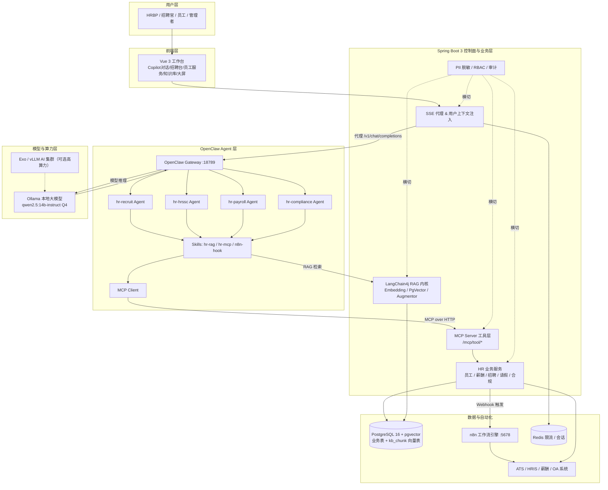
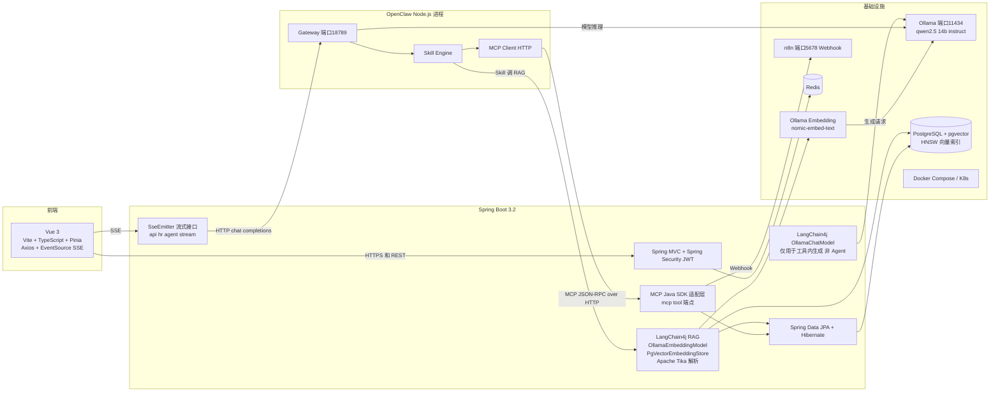
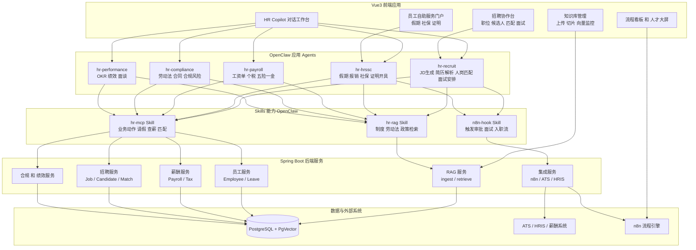

## 一、总体架构图

展示从用户到底层算力/数据的完整链路与分层职责。



## 二、技术架构图

聚焦技术组件、协议、端口与集成关系。



## 三、应用架构图

聚焦 HR 业务功能、Agent 划分、Skill 能力与后端服务的映射。



## 四、核心代码

4.1 OpenClaw 侧：配置与 Skill（Agent 大脑）

openclaw/openclaw.json（Agent、MCP Server、Skill 注册）：
```
{
  "model": { "default": "ollama/qwen2.5:14b-instruct" },
  "agents": {
    "hr-recruit": {
      "model": "ollama/qwen2.5:14b-instruct",
      "systemPromptFile": "SOUL.hr-recruit.md",
      "temperature": 0.6,
      "memory": { "backend": "sqlite", "path": "/root/.openclaw/memory/hr-recruit.sqlite" },
      "skills": ["hr-rag", "hr-mcp", "n8n-hook"],
      "channels": ["rest"]
    },
    "hr-hrssc": {
      "model": "ollama/qwen2.5:14b-instruct",
      "systemPromptFile": "SOUL.hr-hrssc.md",
      "temperature": 0.3,
      "skills": ["hr-rag", "hr-mcp", "n8n-hook"],
      "channels": ["rest"]
    },
    "hr-payroll": {
      "model": "ollama/qwen2.5:14b-instruct",
      "systemPromptFile": "SOUL.hr-payroll.md",
      "temperature": 0.1,
      "skills": ["hr-rag", "hr-mcp"],
      "channels": ["rest"]
    }
  },
  "mcp": {
    "servers": {
      "hr-backend": { "transport": "http", "url": "http://spring-hr:8080/mcp" },
      "rag-service": { "transport": "http", "url": "http://spring-hr:8080/mcp/rag" }
    }
  },
  "skills": {
    "entries": {
      "hr-rag": { "enabled": true, "path": "skills/hr-rag" },
      "hr-mcp": { "enabled": true, "path": "skills/hr-mcp" },
      "n8n-hook": { "enabled": true, "path": "skills/n8n-hook" }
    }
  }
}
```

openclaw/skills/hr-rag/SKILL.md（RAG 检索 Skill，声明必须先用 MCP 工具 rag_retrieve）

```
---
name: hr-rag
description: 检索 HR 制度、劳动法、个税与薪酬政策、招聘规范等知识库
trigger: "制度|劳动法|个税|年假|社保|公积金|政策|JD|简历"
tools:
  - name: rag_retrieve
    description: 从企业向量库检索相关知识片段（由 rag-service MCP Server 提供）
---
# HR RAG 检索 Skill
回答任何涉及 HR 制度、法律法规或历史知识的问题前，**必须先调用 `rag_retrieve`** 获取上下文，再基于上下文回答，并在结尾标注来源 doc_id。

调用约束（categories 按 agent 自动选择）：
- hr-hrssc -> ["HR_POLICY", "LABOR_LAW"]
- hr-payroll -> ["PAYROLL", "LABOR_LAW"]
- hr-recruit -> ["RECRUIT", "HR_POLICY"]
```
## 五、一句话串联执行流

员工问“年假怎么请” → Vue​ 调 /api/hr/agent/stream?agent=hr-hrssc → Spring​ 注入工号上下文并代理到 OpenClaw​ → OpenClaw hr-hrssc Agent 命中 hr-rag Skill → 通过 MCP 调 Spring rag_retrieve 拿制度片段 → 流式回答；员工说“帮我请 3 天” → Agent 调 hr-mcp Skill → Spring applyLeave 工具建单并 Webhook n8n​ → n8n 推送主管审批并回写状态 → 结果经 SSE 回到前端。
