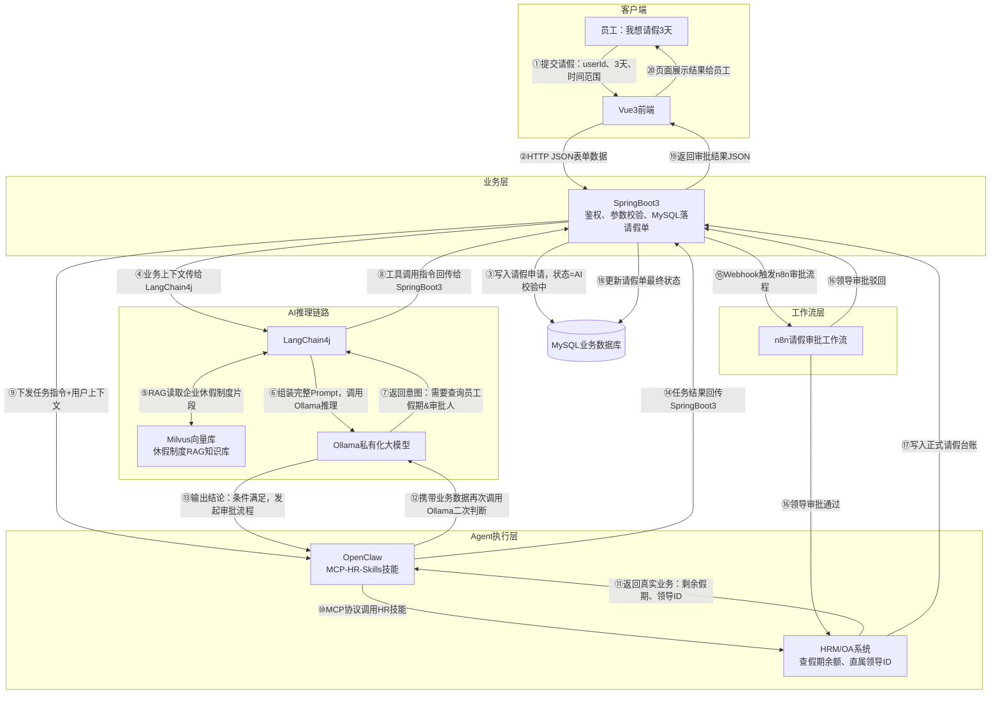
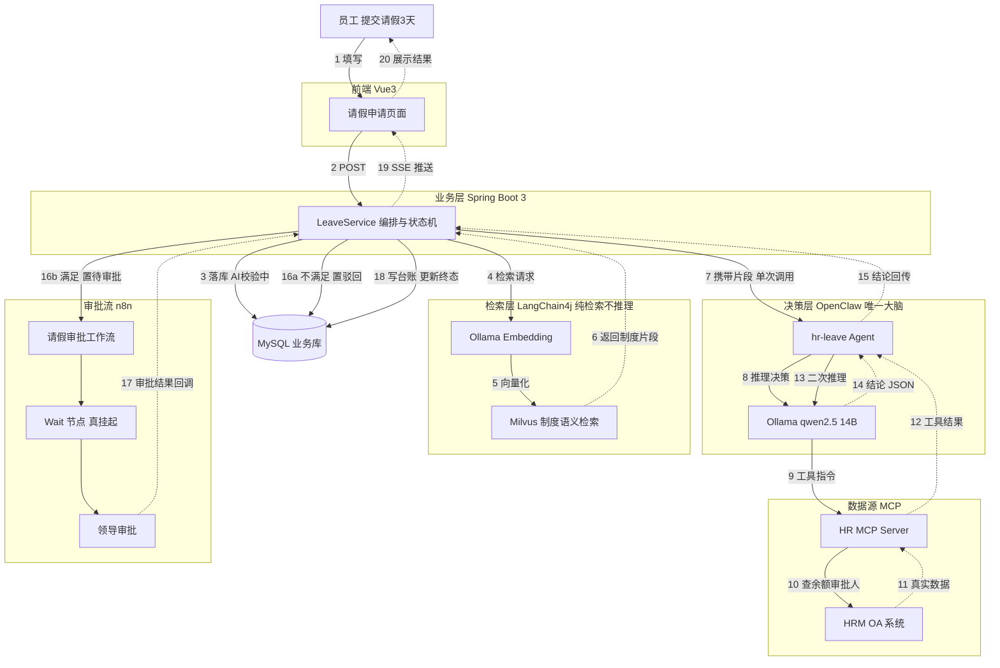
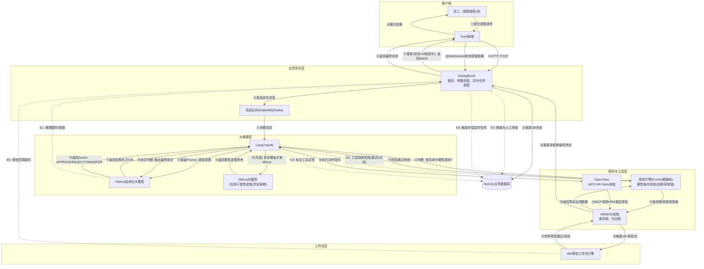

# HR请假业务全链路原型代码
> 业务场景：员工申请请假3天完整AI审批链路
> 组件栈：Vue3 + SpringBoot3 Java17 + LangChain4j 1.19.0 + OpenClaw + Ollama + Milvus + n8n + MySQL

## 整体业务流程图（带编号步骤）

```mermaid
flowchart TD
    subgraph 客户端
        U["员工：我想请假3天"]
        VUE["Vue3前端"]
    end

    subgraph 业务层
        SB["SpringBoot3<br/>鉴权、参数校验、MySQL落请假单"]
    end

    subgraph AI推理链路
        LC["LangChain4j"]
        MILVUS["Milvus向量库<br/>休假制度RAG知识库"]
        OLL["Ollama私有化大模型"]
    end

    subgraph Agent执行层
        OC["OpenClaw<br/>MCP‑HR‑Skills技能"]
        HRM["HRM/OA系统<br/>查假期余额、直属领导ID"]
    end

    subgraph 工作流层
        N8N["n8n请假审批工作流"]
    end

    DB[(MySQL业务数据库)]

    U -->|①提交请假：userId、3天、时间范围| VUE
    VUE -->|②HTTP JSON表单数据| SB
    SB -->|③写入请假申请，状态=AI校验中| DB

    SB -->|④业务上下文传给LangChain4j| LC
    LC <-->|⑤RAG读取企业休假制度片段| MILVUS
    LC -->|⑥组装完整Prompt，调用Ollama推理| OLL
    OLL -->|⑦返回意图：需要查询员工假期&审批人| LC

    LC -->|⑧工具调用指令回传给SpringBoot3| SB
    SB -->|⑨下发任务指令+用户上下文| OC
    OC -->|⑩MCP协议调用HR技能| HRM
    HRM -->|⑪返回真实业务：剩余假期、领导ID| OC
    OC -->|⑫携带业务数据再次调用Ollama二次判断| OLL
    OLL -->|⑬输出结论：条件满足，发起审批流程| OC

    OC -->|⑭任务结果回传SpringBoot3| SB
    SB -->|⑮Webhook触发n8n审批流程| N8N

    N8N -->|⑯领导审批通过| HRM
    N8N -->|⑯领导审批驳回| SB

    HRM -->|⑰写入正式请假台账| SB
    SB -->|⑱更新请假单最终状态| DB
    SB -->|⑲返回审批结果JSON| VUE
    VUE -->|⑳页面展示结果给员工| U
```

## 优化方案1

```mermaid
flowchart TD
    U["员工 提交请假3天"]

    subgraph FE["前端 Vue3"]
        VUE["请假申请页面"]
    end

    subgraph BIZ["业务层 Spring Boot 3"]
        SVC["LeaveService 编排与状态机"]
    end

    subgraph RAGL["检索层 LangChain4j 纯检索不推理"]
        EMB["Ollama Embedding"]
        MIL["Milvus 制度语义检索"]
    end

    subgraph AGT["决策层 OpenClaw 唯一大脑"]
        OC["hr-leave Agent"]
        OL["Ollama qwen2.5 14B"]
    end

    subgraph MCPL["数据源 MCP"]
        SRV["HR MCP Server"]
        HRM["HRM OA 系统"]
    end

    subgraph WF["审批流 n8n"]
        N8N["请假审批工作流"]
        WAIT["Wait 节点 真挂起"]
        LEAD["领导审批"]
    end

    DB[("MySQL 业务库")]

    U -->|"1 填写"| VUE
    VUE -->|"2 POST"| SVC
    SVC -->|"3 落库 AI校验中"| DB
    SVC -->|"4 检索请求"| EMB
    EMB -->|"5 向量化"| MIL
    MIL -.->|"6 返回制度片段"| SVC
    SVC -->|"7 携带片段 单次调用"| OC
    OC -->|"8 推理决策"| OL
    OL -->|"9 工具指令"| SRV
    SRV -->|"10 查余额审批人"| HRM
    HRM -.->|"11 真实数据"| SRV
    SRV -.->|"12 工具结果"| OC
    OC -->|"13 二次推理"| OL
    OL -.->|"14 结论 JSON"| OC
    OC -.->|"15 结论回传"| SVC
    SVC -->|"16a 不满足 置驳回"| DB
    SVC -->|"16b 满足 置待审批"| N8N
    N8N --> WAIT
    WAIT --> LEAD
    LEAD -.->|"17 审批结果回调"| SVC
    SVC -->|"18 写台账 更新终态"| DB
    SVC -.->|"19 SSE 推送"| VUE
    VUE -.->|"20 展示结果"| U
```

## 优化方案二

```mermaid
flowchart TD
    subgraph 客户端
        U["员工：我想请假3天"]
        VUE["Vue3前端"]
    end

    subgraph 业务网关层
        SB["SpringBoot3<br/>鉴权、参数校验、异步任务调度"]
        MQ["消息队列(RabbitMQ/Kafka)"]
    end

    subgraph AI推理层
        LC["LangChain4j"]
        OLL["Ollama私有化大模型"]
        MILVUS["Milvus向量库<br/>(仅用于柔性政策/历史案例)"]
    end

    subgraph 规则与工具层
        RE["规则引擎(Drools/硬编码)<br/>硬性条件校验(余额/审批链)"]
        OC["OpenClaw<br/>MCP‑HR‑Skills技能"]
        HRM["HRM/OA系统<br/>查余额、写台账"]
    end

    subgraph 工作流层
        N8N["n8n审批工作流引擎"]
    end

    DB[(MySQL业务数据库)]

    %% 正常主链路
    U -->|"①提交请假请求"| VUE
    VUE -->|"②HTTP POST"| SB
    SB -->|"③落库(状态=AI校验中), 返回taskId"| VUE
    SB -->|"④发送异步消息"| MQ

    MQ -->|"⑤消费消息"| LC
    LC -->|"⑥组装Prompt, 提取意图"| OLL
    OLL -->|"⑦返回结构化JSON"| LC

    LC -->|"⑧判断: 是否命中硬性规则?"| RE
    RE -->|"⑨查余额/校验审批链"| HRM
    HRM -->|"⑩返回真实业务数据"| RE

    RE -->|"⑪校验通过/失败"| LC
    LC -->|"⑫(可选) 复杂理由才查Milvus"| MILVUS
    MILVUS -->|"⑬返回柔性政策参考"| LC

    LC -->|"⑭综合判断, 输出最终指令"| OLL
    OLL -->|"⑮返回Action: APPROVE/REJECT/TRANSFER"| LC

    LC -->|"⑯执行动作指令"| OC
    OC -->|"⑰MCP调用HRM发起审批"| HRM
    HRM -->|"⑱触发n8n审批流"| N8N

    N8N -->|"⑲领导审批通过/驳回"| HRM
    HRM -->|"⑳更新请假单最终状态"| SB
    SB -->|"㉑更新DB状态"| DB

    VUE -->|"㉒WebSocket/轮询获取结果"| SB
    SB -->|"㉓返回最终状态"| VUE
    VUE -->|"㉔展示结果"| U

    %% 异常与降级链路
    OLL -.->|"E1: 推理超时/报错"| SB
    SB -.->|"E2: 降级为人工审核"| DB

    RE -.->|"E3: 工具调用失败(重试3次后)"| LC
    LC -.->|"E4: 标记工具异常"| DB

    N8N -.->|"E5: 审批回调超时"| SB
    SB -.->|"E6: 触发补偿定时任务"| DB
```
