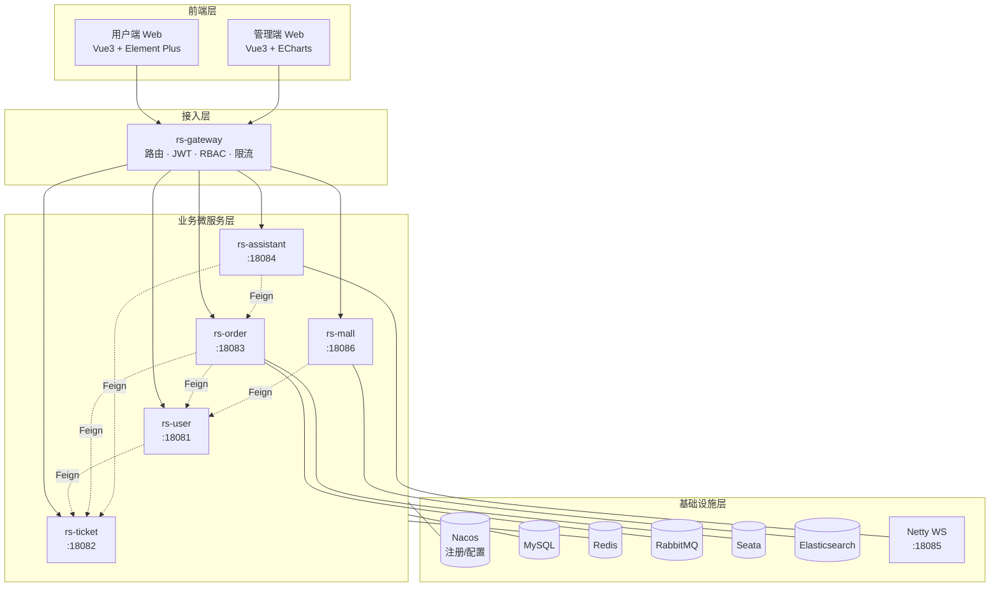
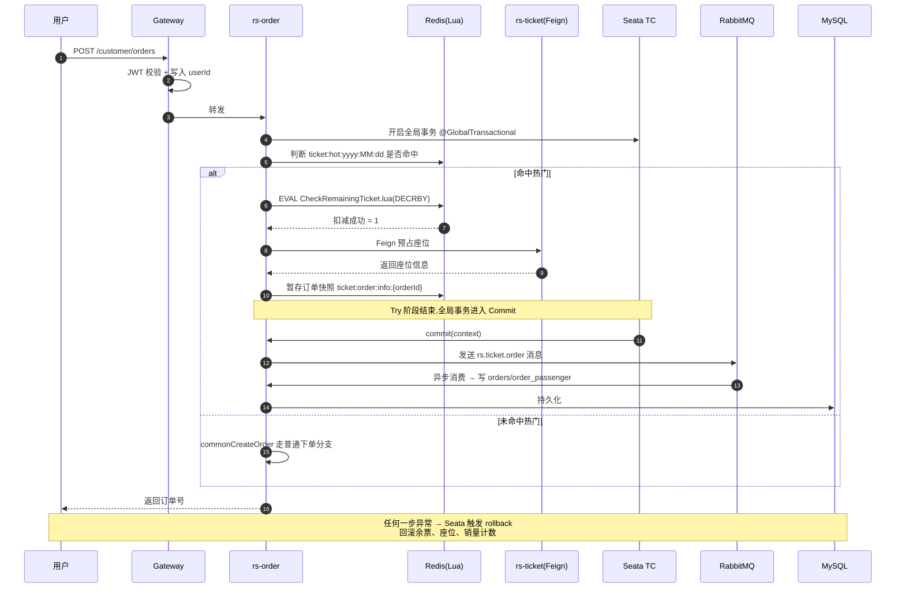

<div align="center">

# ClodRail · 一个能写进简历的 Spring Cloud 实战项目

**高仿 12306 的全栈微服务系统 · 覆盖秒杀、TCC 分布式事务、AI 客服、实时通信**

[](https://spring.io/projects/spring-boot)
[](https://spring.io/projects/spring-cloud)
[](https://github.com/alibaba/spring-cloud-alibaba)
[](https://www.oracle.com/java/technologies/javase-downloads.html)
[](https://vuejs.org/)
[](LICENSE)
[](CONTRIBUTING.md)

[](https://github.com/Dai5297/ClodRail)
[](https://gitee.com/dai5297/clod-rail)

[English](README_EN.md) · [简体中文](README.md) · [快速启动](Docs/99-部署运维/快速启动.md) · [完整文档](Docs/README.md) · [技术专题](Docs/07-亮点技术专题/)


</div>

---

## 为什么值得你 Star

ClodRail 不是又一个 CRUD Demo,也不是教程里拼出来的"微服务 Hello World"。它是一个**按照真实业务场景拆分、能完整跑通"搜索 → 选座 → 下单 → 支付 → 退票 → 积分兑换 → 客服咨询"主流程**的学习型项目,适合大三 / 应届 / 1-3 年工作经验的 Java 工程师作为:

- **简历亮点项目**——技术栈覆盖面试八股的 80% 高频考点(Nacos、Gateway、OpenFeign、Redis、RabbitMQ、Seata、ES、WebSocket)
- **微服务进阶练手**——不止用了中间件,还给出了**为什么选它、怎么组合、踩过什么坑**
- **AI 时代的后端样板**——内置基于 LangChain4j + Netty WebSocket 的 AI 客服,已经跑通会话记忆、流式返回、人工客服转接

### 三个值得一看的硬菜

| 🔥 场景 | 技术组合 | 深度文档 |
|--------|---------|---------|
| **热门车次秒杀一致性** | Redis + Lua 原子扣减 → Seata TCC 两阶段提交 → RabbitMQ 异步落库 | [专题 01](Docs/07-亮点技术专题/01-秒杀一致性.md) |
| **统一网关鉴权 + RBAC** | Spring Cloud Gateway WebFlux 过滤器 + Access/Refresh 双 Token + Redis 权限下放 | [专题 02](Docs/07-亮点技术专题/02-网关鉴权实战.md) |
| **AI 客服 + 实时通信** | LangChain4j(百炼/DashScope)+ Netty WebSocket + 会话记忆持久化 | [专题 03](Docs/07-亮点技术专题/03-AI客服实现.md) |

---

## 系统架构

整体采用**四层分层 + 五大业务微服务**结构,核心链路是 `前端 → 网关 → 业务服务 → 中间件`,所有外部依赖通过 Nacos 统一配置下发。



> 想看每个服务内部怎么分层?见 [架构总览](Docs/00-项目概述/架构总览.md)。

---

## 功能地图

| 模块 | 状态 | 核心能力 |
|------|:---:|------|
| 用户服务 `rs-user` | ✅ | 注册 / 登录(Access + Refresh 双 Token)/ RBAC 权限 / 乘车人管理 |
| 车票服务 `rs-ticket` | ✅ | 车站 / 线路 / 车次 / 余票查询 / 座位库存 / Redis 热点缓存 |
| 订单服务 `rs-order` | ✅ | 普通下单 / 热门秒杀 / TCC 分布式事务 / 支付宝沙箱 / XXL-Job 超时关单 |
| 积分商城 `rs-mall` | ✅ | 商品上下架 / 积分兑换 / Elasticsearch 全文检索 |
| AI 客服 `rs-assistant` | ✅ | LangChain4j 问答 / Netty WebSocket / 会话记忆 / 人工客服转接 |
| 统一网关 `rs-gateway` | ✅ | 路由 / 白名单 / JWT 解析 / RBAC 下放 / 统一异常 |
| VIP 体系 | 🚧 | 会员等级与权益,规划中 |
| 容器化一键部署 | 🚧 | Docker Compose / K8s manifests,规划中 |

---

## 技术栈全景

### 后端

| 分类 | 技术 | 在本项目中用来做什么 |
|------|------|---------------------|
| 核心框架 | Spring Boot **3.5.5** · Spring Cloud **2025.0.0** · SCA 2023.0.3.2 | 项目底座 |
| 注册 / 配置 | **Nacos** 2.2+ | 5 个业务服务 + 网关全部注册发现,公共配置在 Nacos 统一下发 |
| 网关 | **Spring Cloud Gateway**(WebFlux) | 路由 `/customer/**` 和 `/admin/**`;C 端无状态校验 Access Token(JWT,15min),配合业务侧 Refresh Token(UUID,7d,HttpOnly Cookie)撤销;管理端 uuid+Redis 有状态 Session;RBAC 从 `AUTH_ROLE:{id}:apis` Redis Set 做 Ant 路径匹配 |
| 服务调用 | **OpenFeign** + LoadBalancer | `rs-api` 模块统一定义 Feign 客户端,跨服务调用零样板 |
| 分布式事务 | **Seata** TCC 模式 | 订单创建走 `@TwoPhaseBusinessAction`,Try 预占座/预扣票,Commit 异步落库,Rollback 回滚余票和座位 |
| 缓存 / 分布式锁 | **Redis 7** + Redisson + Lua | 热门车次 Bitmap、余票 Lua 原子扣减、Token 存储、秒杀锁 |
| 消息队列 | **RabbitMQ** | TCC Commit 阶段发送 `rs.ticket.order` 消息,订单服务异步落库与积分发放 |
| 搜索引擎 | **Elasticsearch 8** | 积分商城商品全文检索 |
| 实时通信 | **Netty** + WebSocket | AI 客服长连接,同时支持用户端和人工客服端 |
| AI 能力 | **LangChain4j** | 对接 DashScope / 百炼,支持会话记忆、工具调用、流式返回 |
| 任务调度 | **XXL-Job** | 订单超时关单、车次库存预热 |
| 持久层 | MyBatis Plus + MySQL 8 | 单库单表为主,核心表已加索引 |
| 文档 | **Knife4j** | 聚合所有服务的 API 文档 |
| 工具 | Hutool · Lombok · FastJSON | 常用工具 |

### 前端

| 应用 | 技术 |
|------|------|
| 用户端 `rs-user-web` | Vue 3 + Vite + Element Plus + Ant Design Vue + TailwindCSS v3 + Pinia |
| 管理端 `rs-admin-web` | Vue 3 + Vite + Element Plus + ECharts + TailwindCSS v4 + Vue-i18n |

---

## 核心时序:一次热门车次秒杀如何保证一致性

这条链路是整个项目的技术密度最高处,**面试能讲 15 分钟的那种**。



关键设计点(完整解析在 [专题 01](Docs/07-亮点技术专题/01-秒杀一致性.md)):

1. **Redis + Lua 保证扣减原子性**——[`CheckRemainingTicket.lua`](RailwaySystem-Backend/rs-service/rs-order/src/main/resources/lua/CheckRemainingTicket.lua) 做"查 + 减"一次往返
2. **TCC 而非 AT 模式**——热门场景跨服务锁座位,用业务补偿比数据库行锁更轻
3. **Commit 阶段发 MQ 异步落库**——主流程响应快,MQ 消费失败走死信队列重试
4. **Rollback 幂等**——[`OrderServiceImpl#rollback`](RailwaySystem-Backend/rs-service/rs-order/src/main/java/com/rs/service/impl/OrderServiceImpl.java) 根据 `TICKET_DEDUCTION_TAG` 判断是否回滚余票

---

## 服务端口速查

| 服务 | Application Name | 端口 | Nacos 注册名 |
|------|------------------|------|------------|
| 网关 | rs-gateway | **18080** | rs-gateway |
| 用户 | rs-user | 18081 | user-service |
| 车票 | rs-ticket | 18082 | ticket-service |
| 订单 | rs-order | 18083 | order-service |
| 客服(HTTP) | rs-assistant | 18084 | assistant-service |
| 客服(Netty WS) | — | 18085 | — |
| 商城 | rs-mall | 18086 | mall-service |

---

## 3 分钟快速启动

<details>
<summary><b>▶ 点击展开:极简版(已有 Nacos / MySQL / Redis / RabbitMQ 的老司机)</b></summary>

```bash
# 1. 双仓库任选一个 clone
git clone https://github.com/Dai5297/ClodRail.git          # GitHub
git clone https://gitee.com/dai5297/clod-rail.git          # Gitee(国内推荐)

cd ClodRail

# 2. 导入 Nacos 共享配置(仍需在 Nacos 里手动补 shared-knife4j / shared-langchain4j,详见快速启动 §4.2)
mysql -u root -p nacos < Docs/99-部署运维/nacos.sql

# 3. 创建业务库
mysql -u root -p -e "CREATE DATABASE rs_user; CREATE DATABASE rs_ticket; \
  CREATE DATABASE rs_order; CREATE DATABASE rs_mall; \
  CREATE DATABASE rs_assistant; CREATE DATABASE seata;"

# 4. 导入业务表结构
cd RailwaySystem-Backend/rs-service
mysql -u root -p rs_user      < rs-user/src/main/resources/sql/user-init.sql
mysql -u root -p rs_ticket    < rs-ticket/src/main/resources/sql/ticket-init.sql
mysql -u root -p rs_order     < rs-order/src/main/resources/sql/order-init.sql
mysql -u root -p rs_mall      < rs-mall/src/main/resources/sql/mall-init.sql
mysql -u root -p rs_mall      < rs-mall/src/main/resources/sql/item.sql
mysql -u root -p rs_assistant < rs-assistant/src/main/resources/sql/assistant-init.sql

# 5. 拷贝每个服务的 bootstrap-dev.example.yaml → bootstrap-dev.yaml,填入本地 MySQL/Redis 密码

# 6. 必需的环境变量
export RS_AUTH_JWT_KEY="please-replace-with-your-own-random-key-at-least-32-chars"

# 7. 编译
cd ../../.. && cd RailwaySystem-Backend && mvn clean install -DskipTests

# 8. 依序启动:网关 → user → ticket → order → mall → assistant
#    每个模块下 mvn spring-boot:run

# 9. 启动前端(推荐 pnpm)
cd ../RailwaySystem-Frontend/rs-user-web && pnpm install && pnpm dev
```

</details>

完整步骤、依赖版本与故障排查:**[快速启动指南](Docs/99-部署运维/快速启动.md)** · **[环境要求](Docs/99-部署运维/环境要求.md)** · **[FAQ](Docs/FAQ.md)**

启动成功后访问:
- Nacos 控制台 http://localhost:8848/nacos
- API 聚合文档 http://localhost:18080/doc.html
- 用户端 http://localhost:5173
- 管理端 http://localhost:5174

---

## 按身份定制的学习路线

### 我是大三 / 应届生,想把它写进简历

1. 先跑通主流程:[快速启动](Docs/99-部署运维/快速启动.md) → 成功登录 + 下一张订单
2. 从最熟的 `rs-user` 读起,理清 `Controller → Service → Mapper` 三层
3. 重点攻克一个亮点:推荐从 [专题 02 网关鉴权](Docs/07-亮点技术专题/02-网关鉴权实战.md) 开始——WebFlux + JWT + RBAC,面试高频
4. 把"秒杀一致性"能讲清楚:[专题 01](Docs/07-亮点技术专题/01-秒杀一致性.md) 是简历加粗的那一行
5. 用 [ROADMAP](Docs/ROADMAP.md) 挑一个"🚧 规划中"的小任务,提一个 PR——简历里的"**开源贡献经历**"就有了

### 我是 1-3 年工作经验,想补微服务体系

1. 直接看 [架构总览](Docs/00-项目概述/架构总览.md) 和 [技术选型](Docs/00-项目概述/技术选型.md)——重点是"为什么这样拆 / 为什么选这个中间件"
2. 按模块精读:[用户](Docs/01-用户服务/README.md) → [车票](Docs/02-车票服务/README.md) → [订单](Docs/03-订单服务/README.md)(订单是技术密度最高的一个)
3. 读 `rs-util/*` 系列公共模块——Knife4j 聚合、Seata 封装、Netty 启动装配,都是可以直接搬到自己项目的脚手架
4. 想进一步贡献?看 [CONTRIBUTING.md](CONTRIBUTING.md)

---

## 仓库结构

```text
ClodRail/
├── RailwaySystem-Backend/          # 后端聚合工程
│   ├── rs-gateway/                 # 统一网关
│   ├── rs-service/                 # 5 个业务微服务
│   │   ├── rs-user / rs-ticket / rs-order / rs-mall / rs-assistant
│   ├── rs-api/                     # Feign 客户端 + DTO 定义
│   └── rs-util/                    # 公共中间件 starter(mysql/redis/mq/es/netty/seata/...)
├── RailwaySystem-Frontend/
│   ├── rs-user-web/                # 用户端
│   └── rs-admin-web/               # 管理端
├── Docs/                           # 📚 完整项目文档(中文)
│   ├── 00-项目概述/
│   ├── 01-06 各业务模块/
│   ├── 07-亮点技术专题/            # ⭐ 面试级深度文章
│   ├── 99-部署运维/
│   ├── FAQ.md
│   └── ROADMAP.md
├── 原型图/                          # 用户端 / 管理端 / H5 原型
└── resource/                       # 架构图等静态资源
```

---

## Roadmap(节选)

- [ ] VIP 会员体系与权益(车次折扣、积分倍率)
- [ ] Docker Compose 一键启动 + K8s manifests
- [ ] Sentinel 限流熔断接入(当前网关只有基础限流)
- [ ] SkyWalking 链路追踪
- [ ] 前端 E2E 测试(Playwright)
- [ ] 秒杀场景的 JMeter 压测报告

完整待办见 [ROADMAP.md](Docs/ROADMAP.md)。

---

## 贡献 & 社区

欢迎各种形式的参与:

- 🐛 发现 Bug → 提 Issue
- 💡 有好想法 → [讨论区](https://github.com/Dai5297/ClodRail/discussions) 或 Feature Request
- 📝 文档改写、错别字修正也非常欢迎
- 🔧 代码贡献请先读 [贡献指南](CONTRIBUTING.md)

提交规范遵循 [Conventional Commits](https://www.conventionalcommits.org/zh-hans/),示例:

```
feat(order): 新增秒杀场景的 JMeter 压测脚本
fix(gateway): 修复白名单路径大小写敏感问题
docs: 补充 Seata 分布式事务专题文章
```

---

## 开源协议

[MIT](LICENSE) © Dai5297

---

## Star History

如果这个项目对你有帮助,点一下 ⭐ 就是对维护者最好的鼓励。

[](https://star-history.com/#Dai5297/ClodRail&Date)

<div align="center">

**🚄 一个面向真实业务的 Spring Cloud 项目,从"能跑通"走到"讲得清"。**

[GitHub](https://github.com/Dai5297/ClodRail) · [Gitee](https://gitee.com/dai5297/clod-rail) · [完整文档](Docs/README.md) · [报告 Bug](https://github.com/Dai5297/ClodRail/issues) · [提交建议](https://github.com/Dai5297/ClodRail/issues/new)

</div>
