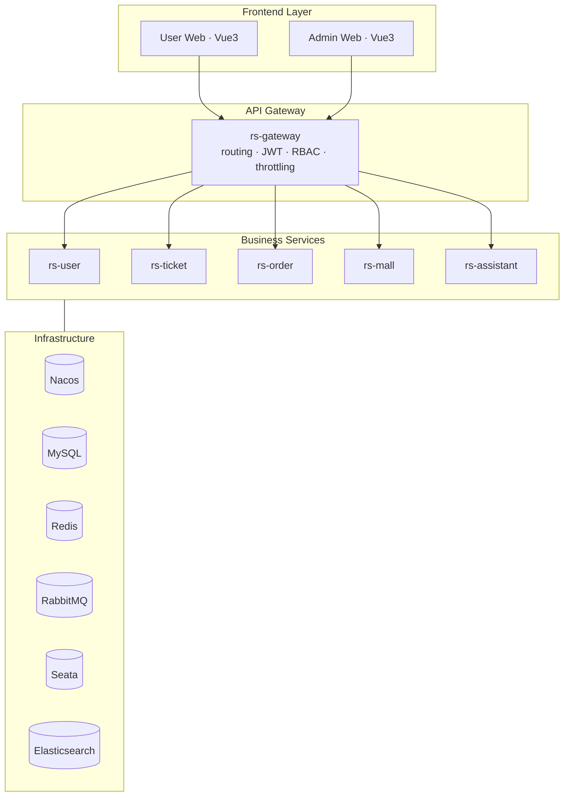

<div align="center">

# ClodRail · A Spring Cloud Project Worth Putting on Your Resume

**A 12306-inspired full-stack microservice railway ticketing system — covering flash-sale consistency, TCC distributed transactions, AI customer service, and real-time messaging.**

[](https://spring.io/projects/spring-boot)
[](https://spring.io/projects/spring-cloud)
[](https://github.com/alibaba/spring-cloud-alibaba)
[](https://www.oracle.com/java/technologies/javase-downloads.html)
[](https://vuejs.org/)
[](LICENSE)
[](CONTRIBUTING.md)

[](https://github.com/Dai5297/ClodRail)

[简体中文](README.md) · **English** · [Quick Start](Docs/99-部署运维/快速启动.md) · [Documentation](Docs/README.md)

> **Note**: Detailed documentation, technical deep-dives, and module specs are maintained in **Simplified Chinese**. This English README gives you the high-level picture; translate with your favorite tool when you dive into a specific topic.


</div>

---

## Why Star This Project

ClodRail isn't another CRUD demo. It's a **complete microservice ticketing system** modeled after the real 12306 business logic — from searching trains, picking seats, placing orders, processing payments, refunding tickets, exchanging loyalty points, to chatting with an AI customer-service agent. Perfect for:

- **Resume-worthy portfolio project** — covers 80% of Spring Cloud interview topics
- **Microservice practice** — not just "uses" middleware but shows **why and how** they're combined
- **AI-era backend reference** — ships with a production-style AI assistant built on LangChain4j + Netty WebSocket

### Three Flagship Scenarios

| Scenario | Tech Combination |
|----------|-----------------|
| **Flash-sale consistency** | Redis + Lua atomic decrement → Seata TCC 2PC → RabbitMQ async persistence |
| **Unified gateway auth + RBAC** | Spring Cloud Gateway WebFlux filter + **Access/Refresh dual-token** + Redis-based permission delegation |
| **AI customer service** | LangChain4j (Qwen/DashScope) + Netty WebSocket + persistent chat memory |

---

## Architecture

Classic 4-layer design with 5 business microservices:



---

## Tech Stack

### Backend

| Layer | Tech |
|-------|------|
| Framework | Spring Boot 3.5.5 · Spring Cloud 2025.0.0 · Spring Cloud Alibaba 2023.0.3.2 |
| Service Discovery | Nacos 2.2+ |
| Gateway | Spring Cloud Gateway (WebFlux) |
| RPC | OpenFeign |
| Distributed Transaction | **Seata TCC** |
| Cache / Lock | Redis 7 + Redisson + Lua |
| Message Queue | RabbitMQ |
| Search | Elasticsearch 8 |
| Real-time | Netty + WebSocket |
| AI | **LangChain4j** (Qwen / DashScope) |
| Job Scheduler | XXL-Job |
| ORM | MyBatis Plus |
| Docs | Knife4j |

### Frontend

- **User Portal**: Vue 3 + Vite + Element Plus + TailwindCSS v3 + Pinia
- **Admin Portal**: Vue 3 + Vite + Element Plus + ECharts + TailwindCSS v4

---

## Feature Map

| Module | Status | Key Capabilities |
|--------|:------:|------------------|
| User Service | ✅ | Register / Login (Access + Refresh dual token) / RBAC / Passengers |
| Ticket Service | ✅ | Stations / Routes / Trains / Seats / Redis hot cache |
| Order Service | ✅ | Regular + Flash-sale order / TCC / Alipay / Timeout cancel |
| Mall Service | ✅ | Products / Point exchange / ES full-text search |
| AI Assistant | ✅ | LangChain4j Q&A / Netty WS / Chat memory / Human transfer |
| Gateway | ✅ | Routing / Whitelist / JWT / RBAC |
| VIP System | 🚧 | On roadmap |
| Docker Deployment | 🚧 | On roadmap |

---

## Quick Start

<details>
<summary><b>▶ Click to expand (assuming Nacos / MySQL / Redis / RabbitMQ are already running)</b></summary>

```bash
# Clone (GitHub or Gitee)
git clone https://github.com/Dai5297/ClodRail.git
cd ClodRail

# Import Nacos shared config (manually create shared-knife4j / shared-langchain4j afterwards, see 快速启动 §4.2)
mysql -u root -p nacos < Docs/99-部署运维/nacos.sql

# Create business databases
mysql -u root -p -e "CREATE DATABASE rs_user; CREATE DATABASE rs_ticket; \
  CREATE DATABASE rs_order; CREATE DATABASE rs_mall; \
  CREATE DATABASE rs_assistant; CREATE DATABASE seata;"

# Import business schemas
cd RailwaySystem-Backend/rs-service
mysql -u root -p rs_user      < rs-user/src/main/resources/sql/user-init.sql
mysql -u root -p rs_ticket    < rs-ticket/src/main/resources/sql/ticket-init.sql
mysql -u root -p rs_order     < rs-order/src/main/resources/sql/order-init.sql
mysql -u root -p rs_mall      < rs-mall/src/main/resources/sql/mall-init.sql
mysql -u root -p rs_mall      < rs-mall/src/main/resources/sql/item.sql
mysql -u root -p rs_assistant < rs-assistant/src/main/resources/sql/assistant-init.sql

# For every service: copy bootstrap-dev.example.yaml → bootstrap-dev.yaml and fill in passwords

# Required env var
export RS_AUTH_JWT_KEY="please-replace-with-your-own-random-key-at-least-32-chars"

# Build
cd ../../.. && cd RailwaySystem-Backend && mvn clean install -DskipTests

# Start services in order:
# rs-gateway → rs-user → rs-ticket → rs-order → rs-mall → rs-assistant
#   (in each module: mvn spring-boot:run)

# Frontend (pnpm recommended)
cd ../RailwaySystem-Frontend/rs-user-web && pnpm install && pnpm dev
```

</details>

After startup:
- Nacos Console: http://localhost:8848/nacos
- Aggregated API Docs: http://localhost:18080/doc.html
- User Portal: http://localhost:5173
- Admin Portal: http://localhost:5174

---

## Repository Structure

```text
ClodRail/
├── RailwaySystem-Backend/          # Backend aggregated project
│   ├── rs-gateway/                 # API gateway
│   ├── rs-service/                 # 5 business microservices
│   ├── rs-api/                     # Feign clients + shared DTOs
│   └── rs-util/                    # Common starters
├── RailwaySystem-Frontend/
│   ├── rs-user-web/                # User portal
│   └── rs-admin-web/               # Admin portal
├── Docs/                           # Full project documentation (CN)
├── 原型图/                          # UI prototypes
└── resource/                       # Static assets
```

---

## Service Ports

| Service | Application Name | Port |
|---------|------------------|------|
| Gateway | rs-gateway | **18080** |
| User | user-service | 18081 |
| Ticket | ticket-service | 18082 |
| Order | order-service | 18083 |
| Assistant (HTTP) | assistant-service | 18084 |
| Assistant (Netty WS) | — | 18085 |
| Mall | mall-service | 18086 |

---

## Roadmap

- [ ] Docker Compose / K8s manifests
- [ ] Sentinel circuit-breaker and rate-limiting
- [ ] SkyWalking distributed tracing
- [ ] VIP membership system
- [ ] JMeter benchmark reports for flash-sale scenarios

See full roadmap in [ROADMAP.md](Docs/ROADMAP.md) (Chinese).

---

## Contributing

All contributions welcome — bug reports, feature requests, docs, code. Please read [CONTRIBUTING.md](CONTRIBUTING.md) first.

Commit convention: [Conventional Commits](https://www.conventionalcommits.org/).

---

## License

[MIT](LICENSE) © Dai5297

---

## Star History

If this project helps you, please consider giving it a ⭐ — it means a lot.

[](https://star-history.com/#Dai5297/ClodRail&Date)

<div align="center">

**🚄 From "it runs" to "I can explain every line" — a Spring Cloud project built for the real world.**

[GitHub](https://github.com/Dai5297/ClodRail) · [Gitee](https://gitee.com/dai5297/clod-rail) · [Full Docs](Docs/README.md) · [Report Bug](https://github.com/Dai5297/ClodRail/issues)

</div>
