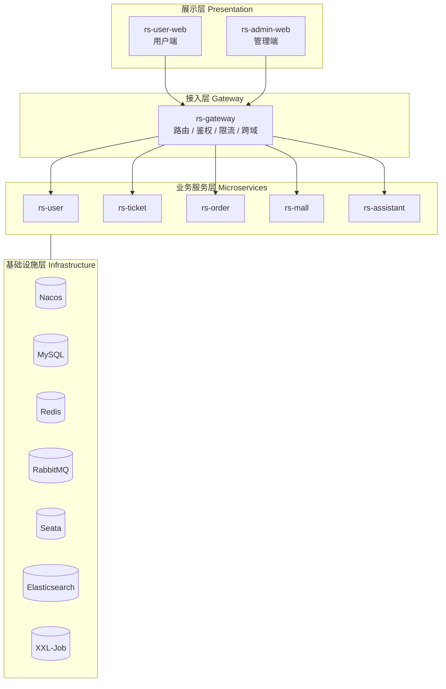
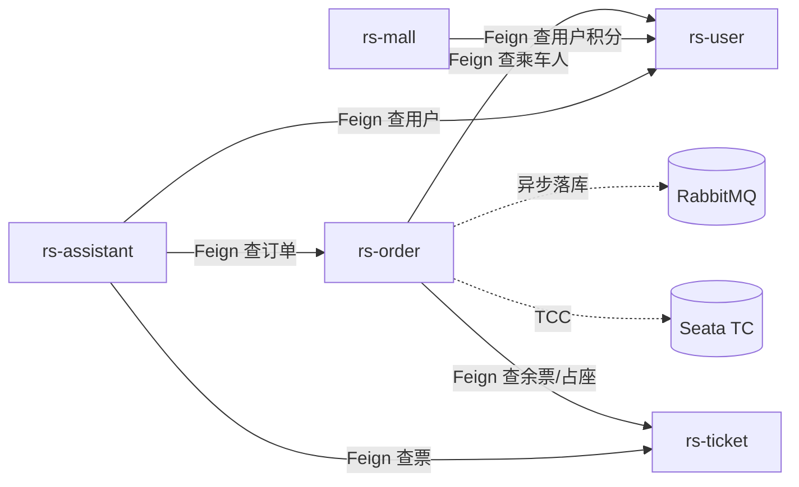
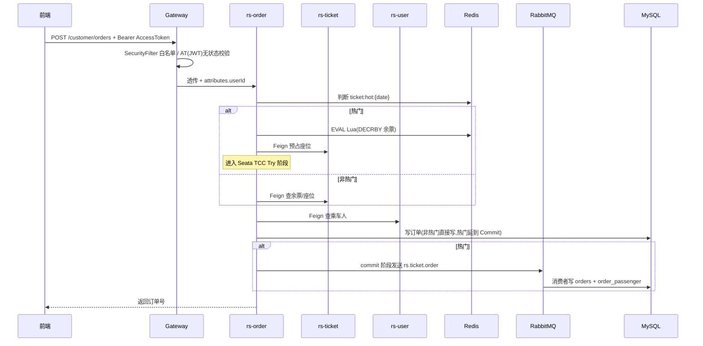
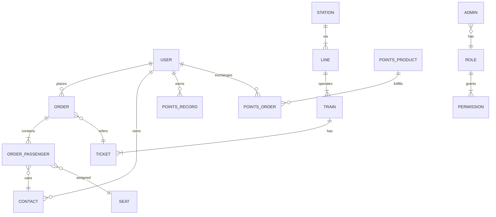

# 架构总览

这篇文档给你一个"从宏观到微观"的全景视角:系统怎么分层、服务怎么交互、数据怎么流动。想直接看某个模块的架构细节,跳到对应的模块文档即可。

## 1. 分层架构

ClodRail 采用经典的四层分层 + 五大业务微服务结构:

**为什么这样分?**

- 前端只与网关通信,业务服务永远不对外暴露 → 鉴权、限流、跨域一处收口。
- 业务服务之间**只走 Feign(同步)或 RabbitMQ(异步)**,没有直连数据库的情况,保证服务边界。
- 中间件全部通过 Nacos 的 "共享配置"下发,换环境只改 namespace。

## 2. 服务职责与交互矩阵

| 服务 | 对外路由前缀 | 依赖的其它服务(Feign) | 核心中间件 |
|------|------------|---------------------|----------|
| `rs-user` | `/customer/user`, `/customer/auth`, `/admin/user`, `/admin/auth` | — | MySQL, Redis |
| `rs-ticket` | `/customer/tickets`, `/customer/stations`, `/admin/tickets`, `/admin/lines`, `/admin/trains` | — | MySQL, Redis, XXL-Job |
| `rs-order` | `/customer/orders`, `/customer/pay`, `/admin/orders` | `rs-ticket`, `rs-user` | MySQL, Redis, RabbitMQ, **Seata**, XXL-Job |
| `rs-mall` | `/customer/points`, `/customer/mall`, `/admin/mall` | `rs-user` | MySQL, Redis, **Elasticsearch** |
| `rs-assistant` | `/customer/assistant`, `/admin/memory` | `rs-ticket`, `rs-order`, `rs-user` | MySQL, Redis, **Netty WS**, **LangChain4j** |

## 3. 端口规划

| 服务 | Application Name | 端口 |
|------|------------------|------|
| 网关 | rs-gateway | **18080** |
| 用户 | user-service | 18081 |
| 车票 | ticket-service | 18082 |
| 订单 | order-service | 18083 |
| 客服 HTTP | assistant-service | 18084 |
| 客服 Netty WS | — | 18085 |
| 商城 | mall-service | 18086 |

外部基础设施默认端口遵循官方(MySQL 3306、Redis 6379、RabbitMQ 5672/15672、Nacos 8848、Seata 8091、ES 9200、XXL-Job 8080)。

## 4. 请求一次下单的完整链路

## 5. 数据模型(简化版 ER)

核心表清单:

- **用户域**:`user`、`admin`、`role`、`permission`、`contact`(乘车人)
- **车票域**:`station`、`line`、`line_station`、`train`、`ticket`、`seat`
- **订单域**:`order`、`order_passenger`
- **商城域**:`points_product`、`points_order`、`points_record`
- **客服域**:`chat_session`、`chat_message`、`agent_memory`

详细字段见每个模块的"数据库设计.md"。

## 6. 配置管理

所有环境相关配置都在 Nacos 的共享 DataId 里:

| Nacos DataId | 内容 |
|--------------|------|
| `shared-mysql.yaml` | 数据源、连接池 |
| `shared-redis.yaml` | Redis 地址、密码 |
| `shared-rabbitmq.yaml` | RabbitMQ 虚拟主机、账号 |
| `shared-seata.yaml` | Seata TC 地址、事务组 |
| `shared-knife4j.yaml` | API 文档聚合规则 |
| `shared-pay.yaml` | 支付宝沙箱密钥 |
| `shared-langchain4j.yaml` | AI 模型 API Key、模型名 |
| `{service}-dev.yaml` | 各服务私有配置 |

每个服务的 `bootstrap.yaml` 只声明 namespace 和要导入的共享配置,**切换环境只需切 namespace**。

## 7. 安全边界

- **C 端用户**:采用 **Access Token + Refresh Token** 双 Token 方案
  - AT 是短命 JWT(15min),放 `Authorization: Bearer` Header,网关 `SecurityFilter`(Order=-100)**纯无状态校验签名 + tokenType + 过期时间**,零 Redis 访问
  - RT 是长命 UUID(7d),由 `HttpOnly + SameSite=Lax` Cookie 下发,只用于 `/customer/auth/refresh` 和 `/logout`,对应 Redis key `user:refresh:token:{uuid}` → userId,`DEL` 即撤销
- **管理端**:基于 uuid + Redis 的有状态 Session(`admin:login:token:{uuid}`,2h 滑动续期),前端拿到的只是 uuid 句柄,真正的 JWT 留在 Redis,支持"强制下线"
- **管理端 RBAC**:权限在登录时下放到 `AUTH_ROLE:{roleId}:apis` Redis Set,网关 `SecurityFilter` 用 AntPathMatcher 做 `METHOD + path` 匹配,**零数据库访问**
- 业务服务通过 `UserContext.get()` 拿到网关注入的 userId,识别调用者
- `/inner/**` 路由不对外暴露,仅供内部 Feign 调用

详细设计见 [专题 02:网关鉴权实战](../07-亮点技术专题/02-网关鉴权实战.md)。

## 下一步

- 🧱 [技术选型](技术选型.md) — 每个中间件的"为什么选它"
- 🧩 回到 [模块文档总目录](../README.md) 看各业务服务的内部设计
- 🔥 [亮点技术专题](../07-亮点技术专题/) — 秒杀 / 鉴权 / AI 客服深度解析
