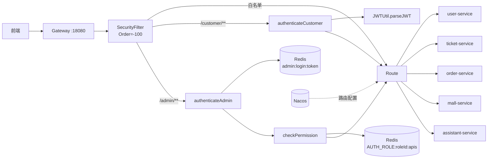
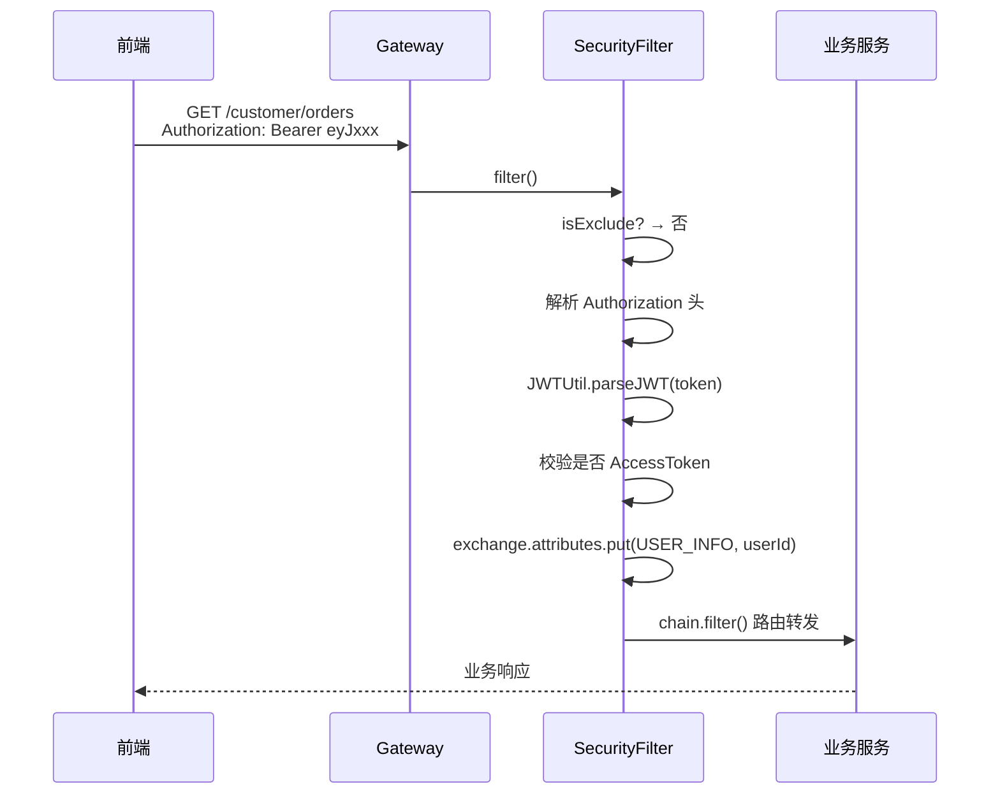
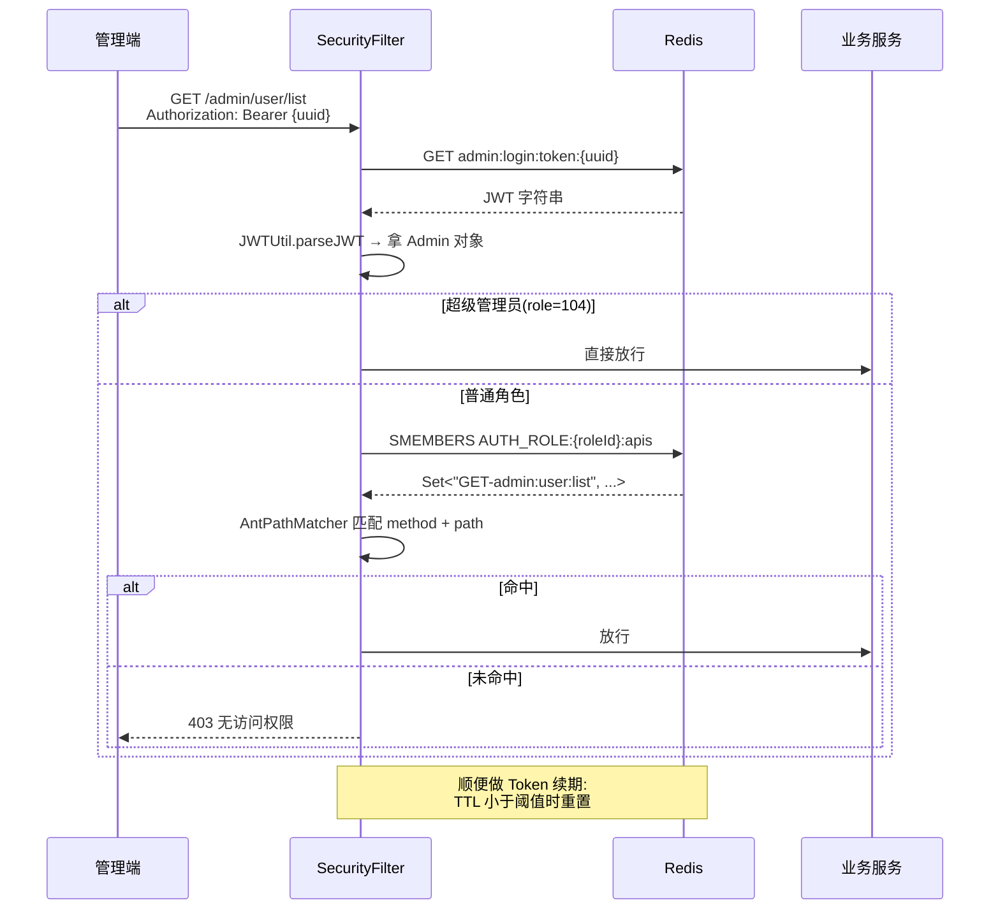

# 网关服务 rs-gateway

> 所有外部流量的唯一入口。路由、JWT 鉴权、RBAC 权限下放、白名单、跨域——一站式收口。

- **服务名**:`rs-gateway`
- **端口**:`18080`
- **源码路径**:[`RailwaySystem-Backend/rs-gateway`](../../RailwaySystem-Backend/rs-gateway)

## 1. 服务职责与边界

| 对外能力 | 说明 |
|---------|------|
| 路由转发 | `/customer/**` 和 `/admin/**` 按前缀路由到业务服务 |
| JWT 鉴权 | 用户端校验 Access Token(JWT 无状态);管理端走 Redis uuid 映射 |
| RBAC 权限 | 管理端额外做"METHOD + path"的 Ant 匹配 |
| 白名单 | 登录、注册、文档等路径放行 |
| 跨域 | 全局 CORS 响应头 |
| 请求属性注入 | 解析出的 `userId` 写入 `exchange.attributes` |

**边界**:

- 不做业务逻辑,也不直连数据库(仅访问 Redis)
- 限流、熔断目前是轻量级实现,重型场景待 Roadmap 接 Sentinel

## 2. 架构图



## 3. 核心业务流程

### 用户端请求鉴权



### 管理端请求鉴权 + RBAC



## 4. 核心代码解说

**主过滤器入口**:

```46:69:RailwaySystem-Backend/rs-gateway/src/main/java/com/rs/filters/SecurityFilter.java
    public Mono<Void> filter(@NonNull ServerWebExchange exchange, @NonNull WebFilterChain chain) {
        if (isExclude(exchange.getRequest().getPath().toString())) {
            return chain.filter(exchange);
        }
        List<String> authorization = exchange.getRequest().getHeaders().get(AUTHENTICATION);
        if (authorization == null || authorization.isEmpty()) {
            return handleError(exchange, RespCode.UNAUTHORIZED, "认证失败");
        }
        String authorizationValue = authorization.get(0);
        if (!authorizationValue.startsWith(AUTH_PREFIX) || authorizationValue.length() <= AUTH_PREFIX.length()) {
            return handleError(exchange, RespCode.UNAUTHORIZED, "认证失败");
        }
        String rawToken = authorizationValue.substring(AUTH_PREFIX.length());
        URI uri = exchange.getRequest().getURI();
        if (uri.getPath().startsWith(USER_PATH_PREFIX)) {
            return authenticateCustomer(rawToken, exchange, chain);
        }
        if (!uri.getPath().startsWith(ADMIN_PATH_PREFIX)) {
            return handleError(exchange, RespCode.UNAUTHORIZED, "认证失败");
        }
        return authenticateAdmin(rawToken, exchange, chain);
    }
```

- `@Order(-100)` 保证这个 Filter 在 Spring Cloud Gateway 的默认 Filter 之前执行
- 按路径前缀分流:`/customer/**` → JWT 解析,`/admin/**` → Redis uuid 映射
- 其它前缀(比如 `/inner/**`)直接拒绝外部访问

**Token 续期**:

```104:111:RailwaySystem-Backend/rs-gateway/src/main/java/com/rs/filters/SecurityFilter.java
        Long expire = stringRedisTemplate.getExpire(key, TimeUnit.MILLISECONDS);

        if (expire != null && expire > 0 && expire < RedisUserKeyConstant.USER_TOKEN_LEAST_TTL) {
            stringRedisTemplate.expire(key,
                    RedisUserKeyConstant.USER_LOGIN_TOKEN_TTL, TimeUnit.MILLISECONDS);
            log.debug("用户token续期成功，uuid: {}", uuid);
        }
```

- 每次请求都检查剩余 TTL,小于阈值就续期
- 管理员长时间操作不会被踢出

## 5. 技术难点 & 踩坑记录

**坑 1:WebFlux 里能用同步 RedisTemplate 吗?**

能,但要理解代价。`StringRedisTemplate` 是阻塞调用,运行在 Gateway 的事件循环线程上会阻塞 I/O。**大流量场景应该换 `ReactiveStringRedisTemplate`**,本项目为了代码可读性用了同步版本,小流量场景问题不大。如果要上生产环境,建议改造。

**坑 2:白名单路径配置的陷阱**

`/customer/auth/login` 在白名单,但 `/customer/auth/loginSms` 如果不写就会被拦截。AntPathMatcher 可以用 `/customer/auth/login*` 解决,但会顺便放过 `/customer/auth/loginByOtherWay` 这种——取舍。项目里用了精确匹配 + 必要时显式加路径。

**坑 3:CORS 预检请求**

浏览器的 OPTIONS 预检不会带 Authorization 头,会被鉴权拦截。Gateway 要么把 OPTIONS 加白名单,要么用 `CorsWebFilter` 放在 SecurityFilter 之前。项目选后者(`@Order` 更小,优先执行)。

**坑 4:SecurityFilter 返回错误响应时怎么结束链路?**

不能 `chain.filter()`,要直接 `exchange.getResponse().writeWith(...)` 把响应写出去。注意 Content-Type 必须设为 `application/json`,否则前端拿到字符串解析不了。

**坑 5:用户端为什么不也走 Redis uuid 方案?**

用户端流量远大于管理端,若每次请求都读 Redis,瓶颈会在 Redis QPS 上。项目用的是 **AT(JWT,无状态)+ RT(UUID,有状态)** 组合:
- 业务请求走 AT,网关无状态校验,零 Redis 访问
- 登出/撤销由 RT 兜底(`DEL user:refresh:token:{uuid}`),用户退出后 RT 立刻失效、AT 最长再活 15 分钟自然过期
- 若业务要求"立即下线",可额外加 `user:blacklist:jti` 黑名单,网关侧对 AT 的 `jti` 做二次校验——以少量性能损耗换强一致性,项目当前未启用

## 📚 相关文档

- [路由配置](路由配置.md)
- [鉴权机制](鉴权机制.md)
- [专题 02:网关鉴权实战](../07-亮点技术专题/02-网关鉴权实战.md) ⭐
