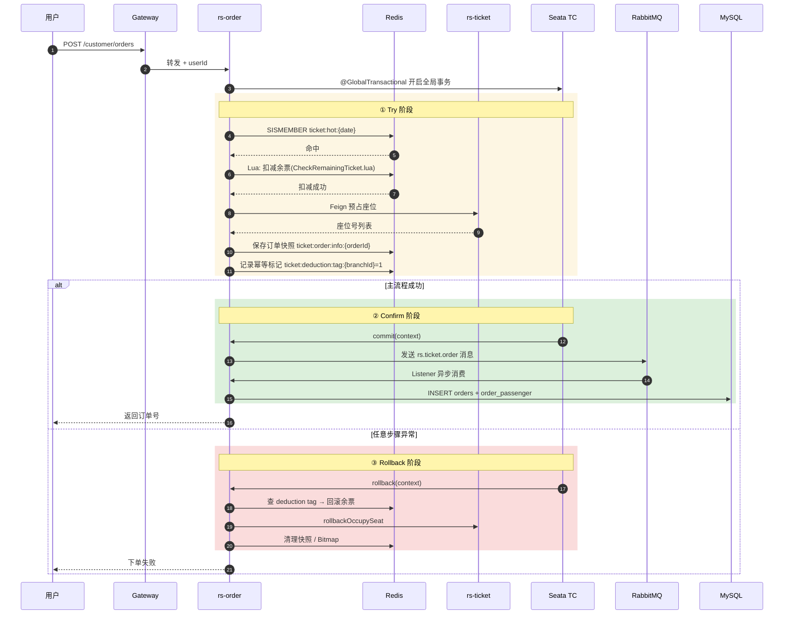

# 从 0 实现高并发抢票:Redis + Lua + TCC 如何保证一致性

> 这篇文章复盘 ClodRail 热门车次下单场景的完整设计思路,涵盖**方案对比、代码解析、踩坑记录**。看完你应该能在面试里独立讲清楚"一张热门票从点击到落库"的每一步。

---

## 一、业务背景

每天春运开票那一刻,"北京—上海 G1 次"这种热门车次会瞬间涌入数万并发。系统要保证:

1. **不超卖**:100 张票绝不能卖出 101 张
2. **不少卖**:有人退票后余票要能被后续用户抢到
3. **响应快**:主流程 RT 不能超过 500ms
4. **跨服务一致**:订单服务写订单,车票服务扣库存+占座,两者必须同生共死
5. **用户维度防重**:同一乘车人同一时段不能买两张冲突的票

这五条要求放一起,就是典型的**跨服务分布式事务**问题。

---

## 二、方案对比

### 方案 A:纯数据库行锁(`SELECT ... FOR UPDATE`)

```sql
BEGIN;
SELECT remaining FROM ticket WHERE id=? FOR UPDATE;
UPDATE ticket SET remaining=remaining-1 WHERE id=?;
INSERT INTO orders(...) VALUES (...);
COMMIT;
```

**问题**:

- 热门行会被长时间锁住,TPS 退化到几十
- 订单表和车票表不在一个服务 → 需要跨服务事务
- MySQL 的 `FOR UPDATE` 本身就是串行化

### 方案 B:Seata AT 模式(自动补偿)

Seata AT 模式会自动生成反向 SQL,开发体验好。**但它会给被修改的行加"全局行锁"**,热门车次场景等于把 MySQL 行锁升级成跨服务行锁,性能更差。

### 方案 C:本地消息表 + 最终一致

发个消息异步扣库存,用本地消息表做补偿。**问题**:用户看到"下单成功"后才扣库存,可能导致实际超卖,体验差。

### 方案 D:Redis + Lua 原子扣减 + Seata TCC 跨服务补偿 ✅

**这是本项目采用的方案**。核心思想:

- **把"扣减"前移到 Redis**,Lua 保证原子性,MySQL 不再是并发瓶颈
- **主流程只走 Redis + 内存操作**,RT 极快
- **跨服务一致性交给 Seata TCC**:Try 阶段预占,Confirm 阶段异步落库,失败走 Rollback
- **落库走 RabbitMQ 解耦**,主流程不等 MySQL

对比表:

| 方案 | TPS | 一致性 | 复杂度 |
|------|-----|--------|--------|
| A 行锁 | ~50 | 强一致 | 低 |
| B Seata AT | ~100 | 强一致 | 中 |
| C 消息表 | ~5000 | 最终一致,有风险 | 中 |
| **D Redis+TCC+MQ** | **~5000** | **强一致(业务维度)** | **高** |

---

## 三、完整链路(时序图)



---

## 四、代码解析

### 4.1 入口:判断是否热门

```97:112:RailwaySystem-Backend/rs-service/rs-order/src/main/java/com/rs/service/impl/OrderServiceImpl.java
    @TwoPhaseBusinessAction(name = "createOrder", commitMethod = "commit", rollbackMethod = "rollback")
    @Override
    public OrderCreateResDTO createOrder(BusinessActionContext context, OrderCreateReqDTO reqDTO) {
        // 预检查时间冲突车票
        preCheckRepeatTime(reqDTO);
        String hotKey = TICKET_HOT + LocalDate.now().format(DateTimeFormatter.ofPattern("yyyy:MM:dd"));
        Boolean isHotTicket = stringRedisTemplate.opsForSet().isMember(hotKey, String.valueOf(reqDTO.getTicketId()));
        if (Boolean.TRUE.equals(isHotTicket)) {
            return seckillTicket(context, reqDTO);
        } else {
            OrderService proxy = (OrderService) AopContext.currentProxy();
            return proxy.commonCreateOrder(reqDTO);
        }
    }
```

两个关键点:

- `@TwoPhaseBusinessAction` 声明这是 Seata TCC 的 Try 方法,`commit` / `rollback` 在同一 Service 里
- `AopContext.currentProxy()` 强制走代理对象,否则内部调用会绕过 Seata + `@Transactional` 切面,**这是新手最容易踩的坑**

### 4.2 Lua 脚本:原子扣减

```lua
-- CheckRemainingTicket.lua
local key = KEYS[1]
local needCount = tonumber(ARGV[1])
local currentStock = tonumber(redis.call('GET', key))
if currentStock == nil or currentStock < needCount then
    return 0
end
redis.call('DECRBY', key, needCount)
return 1
```

为什么必须 Lua?

- 如果用 Java 分两步做 `GET` 和 `DECRBY`,中间会被其他线程插入
- Lua 在 Redis 单线程模型下保证整段原子执行
- 返回值 0/1 比较直观,调用端直接判断即可

Java 侧加载:

```java
private static final DefaultRedisScript<Long> SCRIPT = new DefaultRedisScript<>();

static {
    SCRIPT.setResultType(Long.class);
}

// 使用时:
SCRIPT.setScriptSource(new ResourceScriptSource(
    new ClassPathResource("lua/CheckRemainingTicket.lua")));
Long result = stringRedisTemplate.execute(SCRIPT,
    List.of(stockKey),
    String.valueOf(needCount));
if (result == 0L) throw new CommonException("余票不足");
```

### 4.3 Commit 阶段:发 MQ 落库

```115:145:RailwaySystem-Backend/rs-service/rs-order/src/main/java/com/rs/service/impl/OrderServiceImpl.java
    @Override
    public boolean commit(BusinessActionContext context) {
        log.info("TCC Commit阶段开始执行");
        JSONObject reqDTOJson = (JSONObject) context.getActionContext("reqDTO");
        OrderCreateReqDTO reqDTO = null;
        if (reqDTOJson != null) {
            reqDTO = reqDTOJson.toJavaObject(OrderCreateReqDTO.class);
        }
        if (reqDTO != null) {
            String hotKey = TICKET_HOT + LocalDate.now().format(DateTimeFormatter.ofPattern("yyyy:MM:dd"));
            Boolean isHotTicket = stringRedisTemplate.opsForSet().isMember(hotKey,
                    String.valueOf(reqDTO.getTicketId()));
            if (isHotTicket == null || !isHotTicket) {
                return true;
            }
            String orderId = stringRedisTemplate.opsForValue().get(TICKET_ORDER_ID + context.getBranchId());
            if (orderId != null) {
                CreateTicketOrderMessage orderMessage = new CreateTicketOrderMessage(
                        orderId,
                        reqDTO.getPassengers()
                                .stream()
                                .map(Passenger::getPassengerId)
                                .toList());
                rabbitClient.sendMsg("rs.ticket.order", "ticket.order", orderMessage);
                log.info("TCC Commit阶段执行完成，订单ID: {}", orderId);
            } else {
                log.error("TCC Commit阶段失败，订单不存在");
                throw new CommonException(RespCode.ORDER_NOT_EXIST, "订单不存在");
            }
        }
        return true;
    }
```

Commit 只做一件事:**把订单创建消息扔进 MQ**。实际的 INSERT 由 [`TicketOrderListener`](../../RailwaySystem-Backend/rs-service/rs-order/src/main/java/com/rs/listener/TicketOrderListener.java) 异步消费。好处:

- 主流程响应时间更短
- MQ 消费失败会重试,最终一致
- Seata Commit 本身很轻,Seata TC 压力小

### 4.4 Rollback 幂等

```147:188:RailwaySystem-Backend/rs-service/rs-order/src/main/java/com/rs/service/impl/OrderServiceImpl.java
    @Override
    public boolean rollback(BusinessActionContext context) {
        log.info("TCC Rollback阶段开始执行");

        Map<String, Object> contextData = context.getActionContext();
        if (contextData != null) {
            JSONObject object = (JSONObject) contextData.get("reqDTO");
            OrderCreateReqDTO reqDTO = object.toJavaObject(OrderCreateReqDTO.class);
            String hotKey = TICKET_HOT + LocalDate.now().format(DateTimeFormatter.ofPattern("yyyy:MM:dd"));
            String orderId = stringRedisTemplate.opsForValue().get(TICKET_ORDER_ID + context.getBranchId());
            Boolean isHotTicket = stringRedisTemplate.opsForSet().isMember(hotKey,
                    String.valueOf(reqDTO.getTicketId()));
            rollbackRepeatTime(reqDTO);
            if (isHotTicket == null || !isHotTicket) {
                return true;
            }

            if (orderId != null) {
                seatClient.rollbackOccupySeat(Long.valueOf(orderId));
                stringRedisTemplate.delete(TICKET_ORDER_ID + context.getBranchId());
            }
            String tag = stringRedisTemplate.opsForValue().get(TICKET_DEDUCTION_TAG + context.getBranchId());
            if (tag != null && tag.equals("1")) {
                rollbackRemainingTicket(reqDTO);
            }
            ...
```

幂等关键:

- `TICKET_DEDUCTION_TAG:{branchId}` 只在 Try 阶段扣减成功后设置
- Rollback 先查这个标记,再决定要不要真正回滚余票
- 即使 Seata 因网络抖动重复触发 Rollback,多次执行结果相同

### 4.5 时间冲突检测

**场景**:用户乱点,给同一个乘车人同一时段买了两张冲突的票。

用 Redis Bitmap 实现:每个用户每日一个 1440 位的 Bitmap,每分钟占一位。下单时用 Lua 原子判断 + 置位:

```lua
-- CheckAndSetRepeatTimeBitmap.lua(节选)
local key = KEYS[1]
local startMin = tonumber(ARGV[1])
local endMin = tonumber(ARGV[2])

for i = startMin, endMin do
    if redis.call('GETBIT', key, i) == 1 then
        return 0  -- 冲突
    end
end

for i = startMin, endMin do
    redis.call('SETBIT', key, i, 1)
end
return 1
```

空间上:一天 1440 位 = 180 字节,即使一亿用户也只占 17G,很划算。

---

## 五、面试可讲的五个点

这套方案在面试里可以按这个顺序讲:

1. **为什么不用 AT 模式**:热门场景需要的是"跨服务的业务补偿"而不是"DB 层反向 SQL",AT 会拖低性能
2. **Redis Lua 解决了什么**:Check-Then-Act 的并发问题
3. **TCC 的三个阶段**:Try 预占、Confirm 真正生效、Rollback 业务补偿
4. **为什么 Commit 发 MQ**:解耦主流程 + MQ 失败重试 = 最终一致
5. **幂等标记的 Redis Key 用 branchId**:这是 Seata 分支事务的唯一 ID,保证重复回滚安全

---

## 六、可以继续演进的方向

1. **JMeter 压测报告**:量化从 AT 到 TCC+Redis 的 TPS 提升
2. **限流熔断**:Sentinel 在网关层挡住过载流量
3. **RocketMQ 替换 RabbitMQ**:单日千万订单级别需要换更抗压的 MQ
4. **库存分片**:把一张热门票的库存拆成 N 份,分散到不同 Redis 节点

这些都列在 [ROADMAP](../ROADMAP.md) 里,欢迎 PR。

---

## 📚 延伸阅读

- 模块文档:[订单服务](../03-订单服务/README.md)
- 为什么选 TCC:[技术选型](../00-项目概述/技术选型.md#分布式事务seata-tcc)
- Seata 官方文档:https://seata.apache.org/
