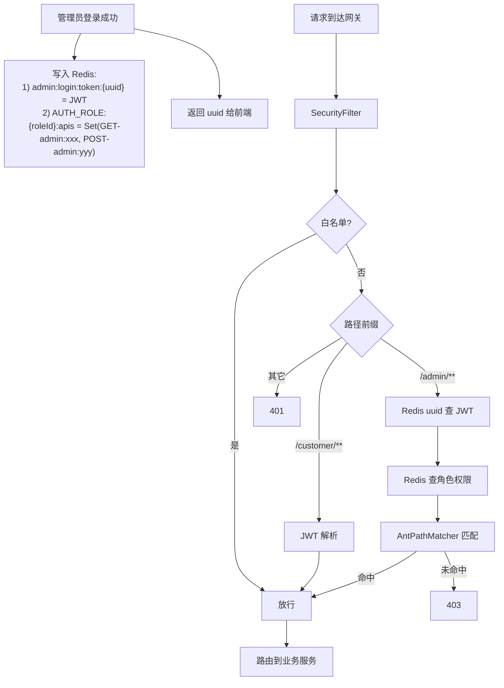

# Spring Cloud Gateway 鉴权实战:WebFlux + 双 Token + Redis RBAC 权限下放

> 网关是微服务的第一道屏障。这篇文章讲清楚 ClodRail 怎么用 **Spring Cloud Gateway + WebFlux** 实现三件事:
> - 用户端 **Access Token(JWT)+ Refresh Token(UUID)双 Token**,AT 由网关无状态校验,RT 由业务侧有状态撤销
> - 管理端基于 **uuid + Redis** 的有状态 Session,支持强制下线
> - RBAC 权限**在登录时下放到 Redis**,请求时网关零数据库查询完成鉴权

---

## 一、问题定义

一个典型微服务系统的鉴权挑战:

1. **用户端和管理端的认证策略往往不同**——用户端追求无状态、高性能;管理端追求可下线、精细权限
2. **权限数据在哪个服务?**——权限模型在 `rs-user`,但校验要在网关,意味着要么网关远程调 `rs-user`,要么把权限数据"下放"到一个共享存储
3. **性能问题**——每次请求都查数据库鉴权,数据库顶不住
4. **WebFlux 坑点**——Gateway 是响应式,直接用同步调用会阻塞事件循环

---

## 二、整体设计



三条关键思路:

- **用户端 AT+RT 双 Token**:
  - **AT(JWT,15 分钟)**:放 `Authorization: Bearer` Header,网关**无状态解析**,零 Redis/DB 访问 → RT 极低
  - **RT(UUID,7 天)**:业务侧以 `HttpOnly + SameSite=Lax` Cookie 下发,只在 `/customer/auth/refresh`、`/logout` 使用;落 Redis(`user:refresh:token:{uuid}` → userId),**登出 = DEL key**,撤销能力兜底
  - 网关本身只关心 AT;**刷新/登出由 `rs-user` 承担**,职责清晰
- **管理端 uuid + Redis 有状态 Session**:前端只拿 uuid,真正的 JWT 存 Redis;对"强制下线 + 权限热更"诉求强的管理端更合适
- **RBAC 权限在登录时写入 Redis**:网关鉴权只需一次 Redis 访问,不再调 `rs-user`,也不查 DB

### 用户端的 AT / RT 生命周期一览

```mermaid
sequenceDiagram
    participant FE as 前端
    participant GW as Gateway
    participant U as rs-user AuthController
    participant R as Redis

    FE->>U: POST /customer/auth/login/username
    U->>U: createAccessToken(userId, 15min)
    U->>R: SET user:refresh:token:{uuid} = userId, TTL=7d
    U-->>FE: Body: { accessToken } + Set-Cookie: REFRESH_TOKEN=xxx; HttpOnly

    loop AT 有效期内(<15min)
        FE->>GW: 业务请求 + Authorization: Bearer AT
        GW->>GW: JWTUtil.parseJWT(AT)(纯内存)
        GW-->>FE: 200
    end

    FE->>GW: 业务请求(AT 已过期)
    GW-->>FE: 401
    FE->>U: POST /customer/auth/refresh (Cookie 携带 RT)
    U->>R: GET user:refresh:token:{uuid}
    U->>U: 生成新 AT
    U->>R: EXPIRE ...:{uuid} 7d(滑动续期)
    U-->>FE: 新 AT + 刷新的 RT Cookie

    FE->>U: POST /customer/auth/logout
    U->>R: DEL user:refresh:token:{uuid}
    U-->>FE: 清空 Cookie
```

---

## 三、代码解析

### 3.1 Filter 入口

```33:69:RailwaySystem-Backend/rs-gateway/src/main/java/com/rs/filters/SecurityFilter.java
@Slf4j
@Component
@Order(-100)
@RequiredArgsConstructor
public class SecurityFilter implements WebFilter {

    private final StringRedisTemplate stringRedisTemplate;

    private final ExcludeProperties excludeProperties;

    private static final AntPathMatcher ANT_PATH_MATCHER = new AntPathMatcher();

    @Override
    public Mono<Void> filter(@NonNull ServerWebExchange exchange, @NonNull WebFilterChain chain) {
        if (isExclude(exchange.getRequest().getPath().toString())) {
            return chain.filter(exchange);
        }
        List<String> authorization = exchange.getRequest().getHeaders().get(AUTHENTICATION);
        if (authorization == null || authorization.isEmpty()) {
            return handleError(exchange, RespCode.UNAUTHORIZED, "认证失败");
        }
        String authorizationValue = authorization.get(0);
        if (!authorizationValue.startsWith(AUTH_PREFIX) || authorizationValue.length() <= AUTH_PREFIX.length()) {
            return handleError(exchange, RespCode.UNAUTHORIZED, "认证失败");
        }
        String rawToken = authorizationValue.substring(AUTH_PREFIX.length());
        URI uri = exchange.getRequest().getURI();
        if (uri.getPath().startsWith(USER_PATH_PREFIX)) {
            return authenticateCustomer(rawToken, exchange, chain);
        }
        if (!uri.getPath().startsWith(ADMIN_PATH_PREFIX)) {
            return handleError(exchange, RespCode.UNAUTHORIZED, "认证失败");
        }
        return authenticateAdmin(rawToken, exchange, chain);
    }
```

三个要点:

- `@Order(-100)`——在 Gateway 默认过滤器之前执行,保证拦截时机
- `implements WebFilter`——响应式 Spring WebFlux 的过滤器接口,返回 `Mono<Void>`
- `isExclude` 基于 `AntPathMatcher`,支持 `/doc.html`、`/swagger-resources/**` 这种通配

### 3.2 用户端分支:AT(JWT)无状态校验

```71:86:RailwaySystem-Backend/rs-gateway/src/main/java/com/rs/filters/SecurityFilter.java
    private Mono<Void> authenticateCustomer(String accessToken, ServerWebExchange exchange, WebFilterChain chain) {
        try {
            Claims claims = JWTUtil.parseJWT(accessToken);
            if (!JWTUtil.isAccessToken(claims)) {
                return handleError(exchange, RespCode.UNAUTHORIZED, "认证失败");
            }
            Long userId = JWTUtil.getUserId(claims);
            if (userId == null) {
                return handleError(exchange, RespCode.UNAUTHORIZED, "认证失败");
            }
            exchange.getAttributes().put(USER_INFO, userId);
            return chain.filter(exchange);
        } catch (Exception e) {
            return handleError(exchange, RespCode.UNAUTHORIZED, "认证失败");
        }
    }
```

特点:

- **零 Redis/DB 访问**,纯内存计算,RT 极低
- `JWTUtil.isAccessToken(claims)` 通过 claims 里的 `tokenType=access` 标识,**避免非 AT 类型的 Token(比如将来引入的其他短命 JWT)被当作 AT 使用**——本项目 RT 用 UUID 不会走这里,但这个校验是"类型隔离"的良好实践
- AT 过期或签名错误直接 401,前端收到 401 后走 `/customer/auth/refresh` 刷新流程,对网关透明
- `exchange.attributes.put(USER_INFO, userId)`——下游服务通过 `UserContext.get()` 拿到 userId

### 3.3 管理端分支:uuid + Redis + RBAC

```88:115:RailwaySystem-Backend/rs-gateway/src/main/java/com/rs/filters/SecurityFilter.java
    private Mono<Void> authenticateAdmin(String uuid, ServerWebExchange exchange, WebFilterChain chain) {
        String key = ADMIN_LOGIN_TOKEN + uuid;
        String token;
        token = stringRedisTemplate.opsForValue().get(key);
        if (token == null || token.isEmpty()) {
            return handleError(exchange, RespCode.UNAUTHORIZED, "认证失败");
        }

        Claims claims;
        String subject;
        try {
            claims = JWTUtil.parseJWT(token);
            subject = claims.getSubject();
        } catch (Exception e) {
            return handleError(exchange, RespCode.UNAUTHORIZED, "认证失败");
        }
        Long expire = stringRedisTemplate.getExpire(key, TimeUnit.MILLISECONDS);

        if (expire != null && expire > 0 && expire < RedisUserKeyConstant.USER_TOKEN_LEAST_TTL) {
            stringRedisTemplate.expire(key,
                    RedisUserKeyConstant.USER_LOGIN_TOKEN_TTL, TimeUnit.MILLISECONDS);
            log.debug("用户token续期成功，uuid: {}", uuid);
        }
        Admin admin = JSONUtil.toBean(subject, Admin.class);
        exchange.getAttributes().put(USER_INFO, admin.getId());
        return checkPermission(admin, exchange, chain);
    }
```

三个设计亮点:

1. **uuid 挡在 JWT 前面**——前端拿到的是 uuid,真正的 JWT 只存在 Redis。即使 uuid 泄露,服务端删掉 Redis 记录就等于踢下线
2. **自动续期**——TTL 不足阈值时自动延长,管理员长时间操作不会被踢
3. **权限校验下一步做**——`checkPermission(admin, ...)` 单独处理 RBAC

### 3.4 RBAC 权限下放核心

```117:136:RailwaySystem-Backend/rs-gateway/src/main/java/com/rs/filters/SecurityFilter.java
    private Mono<Void> checkPermission(Admin admin, ServerWebExchange exchange, WebFilterChain chain) {
        if (Objects.equals(admin.getRole(), 104)) {
            return chain.filter(exchange);
        }
        String key = AUTH_ROLE + admin.getRole() + ":apis";
        Set<String> members = stringRedisTemplate.opsForSet().members(key);
        if (members != null) {
            for (String member : members) {
                String[] split = member.split("-");
                String requestMethod = split[0];
                String requestPath = split[1];
                requestPath = "/" + requestPath.replace(":", "/");
                if (Objects.equals(requestMethod, exchange.getRequest().getMethod().toString())
                        && ANT_PATH_MATCHER.match(requestPath, exchange.getRequest().getURI().getPath())) {
                    return chain.filter(exchange);
                }
            }
        }
        return handleError(exchange, RespCode.FORBIDDEN, "无访问权限");
    }
```

关键:

- **权限数据不在网关查库**——数据在登录时由 `rs-user` 写入 Redis(`AUTH_ROLE:{roleId}:apis` Set),网关只读不写
- `104` 是超级管理员快速通道,避免权限表过大时的 Set 遍历开销
- 用 `AntPathMatcher` 支持 `/admin/user/*` 这种路径通配

### 3.5 权限数据的"下放"时机

在 `rs-user` 的管理员登录流程里:

```java
// AdminAuthServiceImpl 中的伪代码
public String login(AdminLoginDTO dto) {
    Admin admin = adminMapper.selectByUsername(dto.getUsername());
    // 校验密码 ...
    String jwt = JWTUtil.generate(admin);
    String uuid = UUID.randomUUID().toString().replace("-", "");

    // 1. 写 Token
    redis.opsForValue().set(ADMIN_LOGIN_TOKEN + uuid, jwt, 2, TimeUnit.HOURS);

    // 2. 下放权限到 Redis(关键)
    List<Permission> perms = permissionMapper.listByRoleId(admin.getRole());
    Set<String> apiSet = perms.stream()
        .filter(p -> p.getType() == PermType.API)
        .map(p -> p.getMethod() + "-" + p.getPath().replace("/", ":"))
        .collect(Collectors.toSet());
    redis.opsForSet().add(AUTH_ROLE + admin.getRole() + ":apis", apiSet.toArray(new String[0]));

    return uuid;
}
```

**为什么要下放?**

- 网关和 `rs-user` 跨服务调用代价高,每个请求都调 = 把 RPS 乘以 2
- 权限数据变化不频繁(普通管理员不会每秒改权限)
- Redis 做共享存储,天然适合"多节点共用一份权限"

**权限变更怎么同步?**

- 管理员在管理端改了角色权限 → `rs-user` 更新 DB → **主动失效 `AUTH_ROLE:{roleId}:apis`**
- 下次该角色用户登录时重新下放
- 激进方案:权限变更时直接重写 Redis(本项目采用)

---

## 四、为什么 WebFlux 网关里敢用同步 Redis?

教科书会告诉你:WebFlux 线程里不能有阻塞调用。**但现实是 Redis 调用在内网 < 1ms,阻塞代价小于切换响应式 Reactor 的代码复杂度代价**。

本项目的取舍:

- **学习场景**:代码可读性优先,用同步 `StringRedisTemplate`
- **生产场景**:切换到 `ReactiveStringRedisTemplate`,全链路 `Mono.flatMap` 串联

如果你要把这套方案搬到生产,改造成响应式只需要替换几个方法调用:

```java
return reactiveRedis.opsForValue().get(key)
    .switchIfEmpty(Mono.error(new UnauthorizedException()))
    .flatMap(token -> parseJWT(token))
    .flatMap(claims -> reactiveRedis.opsForSet().members(AUTH_ROLE + roleId + ":apis")
        .collectList()
        .flatMap(perms -> checkPermission(perms, method, path) ? chain.filter(exchange) : denied()));
```

---

## 五、Redis Key 设计速查

| Key | 类型 | 含义 | TTL |
|-----|------|------|-----|
| `admin:login:token:{uuid}` | String | 管理员 Session(存 JWT) | 2h 自动续期 |
| `AUTH_ROLE:{roleId}:apis` | Set | 角色可访问的 METHOD-path 列表 | 跟随角色生命周期 |
| `user:refresh:token:{uuid}` | String | 用户端 Refresh Token → userId | 7d,刷新时滑动续期 |
| `user:login:time:{userId}` | String | 用户最近登录时间 | — |

Set 元素格式:`"GET-admin:user:list"`——Method 和 Path 用 `-` 分隔,Path 里的 `/` 转成 `:`(避开 Redis key 可视化工具的显示问题)。

---

## 六、面试可讲要点

1. **为什么用 AT+RT 双 Token,而不是单一长命 JWT?**
   - AT 短命(15min)→ 泄露窗口小;RT 有状态 → 登出/踢人可兜底
   - AT 放 Header(多端适配、无 CSRF 问题);RT 放 HttpOnly+SameSite Cookie(防 XSS 长期凭据泄露)
   - 两者职责完全拆分:AT 进业务请求、RT 只进刷新/登出接口 → **最小权限暴露**
2. **RT 为什么用 UUID 而不是 JWT?**
   - RT 的核心诉求是"可撤销",JWT 的自验证性恰恰破坏了这一点
   - UUID + Redis 反查,语义最直白:**Redis 里 key 没了 = 凭据失效**
3. **登出后已签发的 AT 仍可用 15 分钟,怎么办?**
   - 这是无状态 AT 的固有代价,项目用 AT 短 TTL 将风险压到最小
   - 若业务有强一致诉求:补一个 `user:blacklist:jti` 黑名单,网关侧二次校验
4. **用户端和管理端为什么策略不同?**
   - C 端用户量大,不适合每请求查 Redis,用 AT 无状态 + RT 有状态组合达到平衡
   - 管理端规模小,强制下线/权限热更诉求强,直接走 uuid+Redis 全有状态
5. **权限数据为什么下放 Redis?**
   - 降低网关鉴权延迟 + 避免跨服务调用
   - 权限变更不频繁,缓存命中率极高;变更时主动失效即可
6. **响应式网关里用同步 Redis 的代价?**
   - 内网 Redis < 1ms,阻塞代价通常小于响应式代码复杂度;生产可切 `ReactiveStringRedisTemplate` 全链路异步

---

## 七、继续演进

- [ ] 接入 Sentinel,在网关层做限流、熔断、降级
- [ ] 把同步 Redis 调用改造成 `ReactiveStringRedisTemplate`
- [ ] 加 Token 黑名单支持用户端强制下线
- [ ] 加接口级粒度限流(当前只有全局限流)
- [ ] 审计日志:所有 /admin/** 请求落日志表

---

## 📚 延伸阅读

- 模块文档:[网关服务](../06-网关服务/README.md)
- [鉴权机制](../06-网关服务/鉴权机制.md)
- [路由配置](../06-网关服务/路由配置.md)
