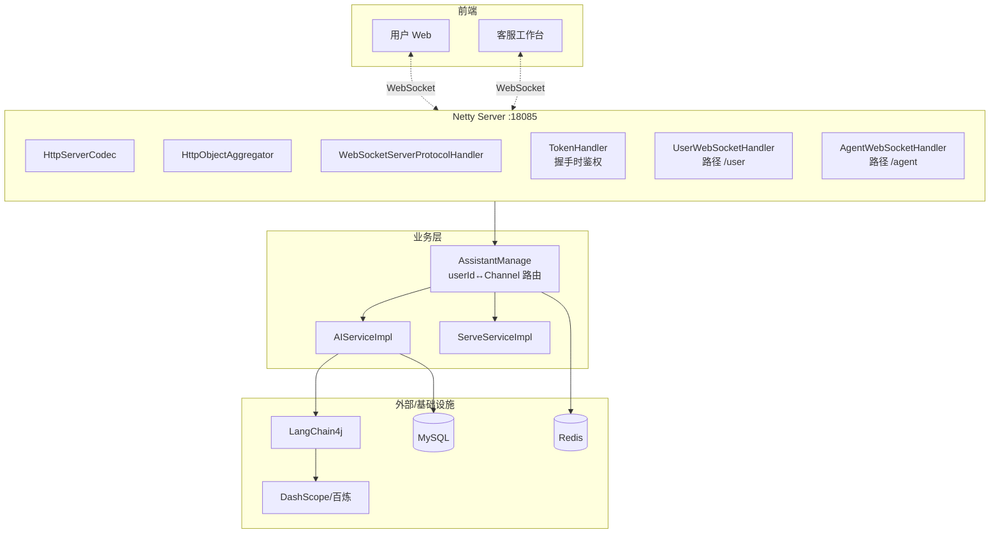
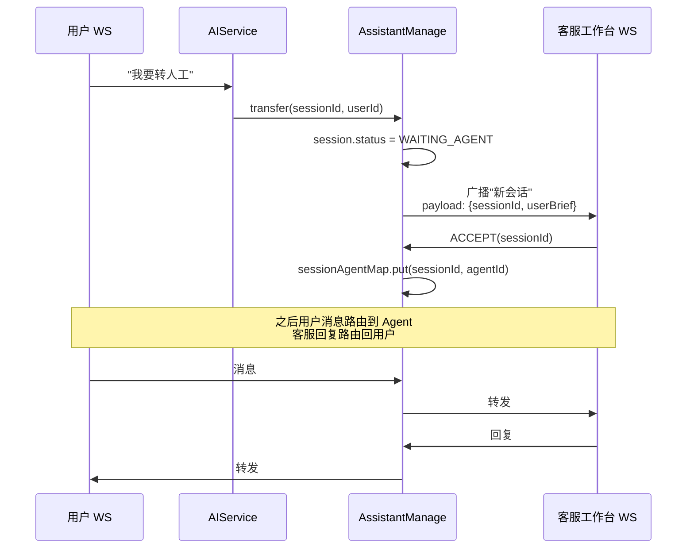

# LangChain4j + Netty WebSocket:从零搭建一个可商用的 AI 客服

> 这篇文章覆盖 ClodRail AI 客服模块(`rs-assistant`)的完整实现:**Netty 启动装配、WebSocket 协议接入、LangChain4j 模型调用、流式返回、会话记忆持久化、人工客服转接**。是一份"AI 时代 Java 后端"的实战样本。

---

## 一、为什么要做这个模块

2024 起 AI 成为 Java 后端面试的新增高频点,但大多数学习项目还停留在"调用一下 ChatGPT 接口"。ClodRail 里的 `rs-assistant` 想做得更"工程化"一些:

- **会话记忆**:AI 能记住上下文,不是每次都从零开始
- **工具调用**:AI 能主动查订单、查车票,而不是瞎答
- **流式返回**:用户像聊 ChatGPT 一样看到字一个个蹦出来
- **人工转接**:AI 兜不住时转真人客服
- **多端接入**:同一套服务同时支持用户端和客服工作台

---

## 二、整体架构



---

## 三、Netty 启动装配

### 3.1 为什么自己写 Netty 而不用 Spring WebSocket?

- 更自由的 Pipeline 控制(加空闲检测、自定义编解码)
- 吞吐性能更高,单机 10w+ 连接无压力
- 贴近 NIO / Reactor 的面试八股,学习价值更大

### 3.2 启动代码(精简版)

```java
// NettyConfig.java 的核心思路
@Bean
public ApplicationRunner nettyStarter() {
    return args -> {
        EventLoopGroup boss = new NioEventLoopGroup(1);
        EventLoopGroup worker = new NioEventLoopGroup();
        ServerBootstrap bootstrap = new ServerBootstrap()
            .group(boss, worker)
            .channel(NioServerSocketChannel.class)
            .childHandler(new ChannelInitializer<SocketChannel>() {
                @Override
                protected void initChannel(SocketChannel ch) {
                    ch.pipeline()
                        .addLast(new HttpServerCodec())
                        .addLast(new HttpObjectAggregator(65536))
                        .addLast(new ChunkedWriteHandler())
                        .addLast(new IdleStateHandler(120, 0, 0))
                        .addLast(new WebSocketServerProtocolHandler("/user"))
                        .addLast(tokenHandler)
                        .addLast(userWebSocketHandler);
                    // 另一条 pipeline 绑 /agent 同理
                }
            });
        bootstrap.bind(18085).sync();
    };
}
```

几个 Handler 的职责:

| Handler | 作用 |
|---------|------|
| `HttpServerCodec` | HTTP 编解码 |
| `HttpObjectAggregator` | 聚合分片 HTTP 报文成完整 FullHttpRequest |
| `ChunkedWriteHandler` | 支持大数据分片写 |
| `IdleStateHandler(120,0,0)` | 120 秒无读就触发超时,断开僵尸连接 |
| `WebSocketServerProtocolHandler` | 处理 WebSocket 握手、ping/pong |
| `TokenHandler` | 握手阶段做 JWT 校验 |
| `UserWebSocketHandler` | 业务逻辑,消息转 AI 或人工 |

---

## 四、会话记忆的实现

### 4.1 LangChain4j 的 ChatMemory

LangChain4j 内置了两种记忆:

- `MessageWindowChatMemory`——保留最近 N 条消息(按条数)
- `TokenWindowChatMemory`——保留最近 N 个 Token(按 Token 数)

本项目用 `MessageWindowChatMemory(20)`——保留最近 20 条,对话可以持续跨多轮。

### 4.2 持久化:自定义 ChatMemoryStore

默认的 `InMemoryChatMemoryStore` 重启就丢。生产级要用数据库持久化:

```java
@Component
public class MysqlChatMemoryStore implements ChatMemoryStore {

    @Autowired
    private MemoryMapper memoryMapper;

    @Override
    public List<ChatMessage> getMessages(Object memoryId) {
        return memoryMapper.listBySession((Long) memoryId).stream()
            .map(this::deserialize)
            .toList();
    }

    @Override
    public void updateMessages(Object memoryId, List<ChatMessage> messages) {
        // 删除旧的 → 插入新的(简化)
        memoryMapper.deleteBySession((Long) memoryId);
        for (int i = 0; i < messages.size(); i++) {
            memoryMapper.insert((Long) memoryId, i, serialize(messages.get(i)));
        }
    }

    @Override
    public void deleteMessages(Object memoryId) {
        memoryMapper.deleteBySession((Long) memoryId);
    }
}
```

然后在 `RailwayAgentConfig` 里装配:

```java
@Bean
public ChatMemoryProvider chatMemoryProvider(MysqlChatMemoryStore store) {
    return sessionId -> MessageWindowChatMemory.builder()
        .id(sessionId)
        .maxMessages(20)
        .chatMemoryStore(store)
        .build();
}
```

**坑点**:`maxMessages(20)` 控制的是传给模型的上下文,不是数据库存的。数据库里可以存全量,只是每次请求模型时截取最近 20 条。

---

## 五、流式返回(Streaming)

### 5.1 为什么要流式

AI 模型逐 Token 生成,如果等全部生成完再返回,用户要等 3-5 秒看到第一个字。流式返回可以做到"0.5 秒首字出现",体验大幅提升。

### 5.2 LangChain4j 的 StreamingChatLanguageModel

```java
StreamingChatLanguageModel model = QwenStreamingChatModel.builder()
    .apiKey(apiKey)
    .modelName("qwen-plus")
    .temperature(0.7f)
    .build();

// 调用:
model.generate(messages, new StreamingResponseHandler<AiMessage>() {
    @Override
    public void onNext(String token) {
        // 每个 token 推送给前端
        channel.writeAndFlush(new TextWebSocketFrame(
            Message.of(role, token).toJson()
        ));
    }

    @Override
    public void onComplete(Response<AiMessage> response) {
        // 一次完整响应结束,保存到 DB
        memoryMapper.insert(sessionId, AiMessage.from(response.content().text()));
        channel.writeAndFlush(new TextWebSocketFrame(Message.endMarker()));
    }

    @Override
    public void onError(Throwable error) {
        log.error("模型调用出错", error);
        channel.writeAndFlush(new TextWebSocketFrame(Message.error("AI 出错了")));
    }
});
```

### 5.3 背压问题

模型每秒吐 20-30 Token,Netty 写 WebSocket 如果客户端消费慢,默认会进入 ChannelOutboundBuffer 堆积,最终 OOM。

解决:

```java
@Override
public void onNext(String token) {
    if (channel.isWritable()) {
        channel.writeAndFlush(new TextWebSocketFrame(tokenPayload));
    } else {
        // 可写为 false 时暂不 flush,Netty 会自动缓冲
        channel.write(new TextWebSocketFrame(tokenPayload));
    }
}
```

也可以在 pipeline 设置高低水位:

```java
ch.config().setWriteBufferWaterMark(new WriteBufferWaterMark(32 * 1024, 64 * 1024));
```

---

## 六、工具调用(Tools)

AI 能"主动查订单"是本模块的精髓。LangChain4j 用 `@Tool` 注解:

```java
@Component
@RequiredArgsConstructor
public class RailwayTools {

    private final OrderClient orderClient;
    private final TicketClient ticketClient;

    @Tool("查询用户当前有效的订单列表")
    public String listMyOrders(@P("用户ID") Long userId) {
        List<OrderListResDTO> orders = orderClient.listByUser(userId);
        return JSONUtil.toJsonStr(orders);
    }

    @Tool("根据车次号查询余票和座位类型")
    public String queryTicket(@P("车次号") String trainNo, @P("日期 yyyy-MM-dd") String date) {
        return JSONUtil.toJsonStr(ticketClient.query(trainNo, date));
    }
}
```

在 `RailwayAgentConfig` 注册:

```java
@Bean
public Assistant assistant(
    StreamingChatLanguageModel model,
    ChatMemoryProvider memoryProvider,
    RailwayTools tools
) {
    return AiServices.builder(Assistant.class)
        .streamingChatLanguageModel(model)
        .chatMemoryProvider(memoryProvider)
        .tools(tools)
        .build();
}
```

用户说"我最近有什么订单" → 模型识别意图 → 触发 `listMyOrders(userId)` → 拿到真实数据 → 组装成自然语言回复。

**坑点**:

- 工具方法必须是 Spring Bean
- 参数必须标 `@P` 写清含义,否则模型不知道怎么填
- 返回值用 JSON 字符串,模型能解析出结构

---

## 七、人工客服转接

### 7.1 触发方式

- 用户主动说"转人工"
- AI 识别到负面情绪或明确求助(通过系统 Prompt 配置)

### 7.2 转接流程



### 7.3 AssistantManage 的核心数据结构

```java
@Component
public class AssistantManage {
    // userId → 用户的 Channel
    private final Map<Long, Channel> userChannels = new ConcurrentHashMap<>();
    // agentId → 客服 Channel
    private final Map<Long, Channel> agentChannels = new ConcurrentHashMap<>();
    // sessionId → 正在接待它的 agentId(没有就走 AI)
    private final Map<Long, Long> sessionAgentMap = new ConcurrentHashMap<>();

    public void dispatch(Long userId, String content) {
        Long sessionId = currentSession(userId);
        Long agentId = sessionAgentMap.get(sessionId);
        if (agentId != null) {
            // 转人工
            Channel agent = agentChannels.get(agentId);
            agent.writeAndFlush(wrap(userId, content));
        } else {
            // 走 AI
            aiService.chatStream(sessionId, content, userChannels.get(userId));
        }
    }
}
```

---

## 八、面试可讲的五个点

1. **为什么自己写 Netty 而不用 Spring WebSocket**——可控性、性能、学习价值
2. **LangChain4j 的 ChatMemory 怎么持久化**——自定义 ChatMemoryStore + MySQL
3. **流式响应怎么防背压**——`channel.isWritable()` + WriteBufferWaterMark
4. **工具调用的工作原理**——AI 模型识别意图、生成参数、调用方法、拿结果重新生成回答
5. **人工转接怎么做路由**——三张 Map 在 AssistantManage 里维护状态机

---

## 九、可以继续演进

- [ ] RAG:把"铁路规章制度"做成知识库,让 AI 有更准确的专业回答
- [ ] Agent 编排:复杂任务(改签)分步调用多个工具
- [ ] 模型切换策略:根据问题复杂度动态选择 qwen-turbo / qwen-plus / qwen-max
- [ ] 客服绩效统计:接待量、平均响应时长、满意度
- [ ] 语音接入:WebRTC + 百度语音合成

---

## 📚 延伸阅读

- 模块文档:[客服助手](../05-客服助手/README.md)
- LangChain4j 官方:https://docs.langchain4j.dev/
- Netty in Action(书籍)
